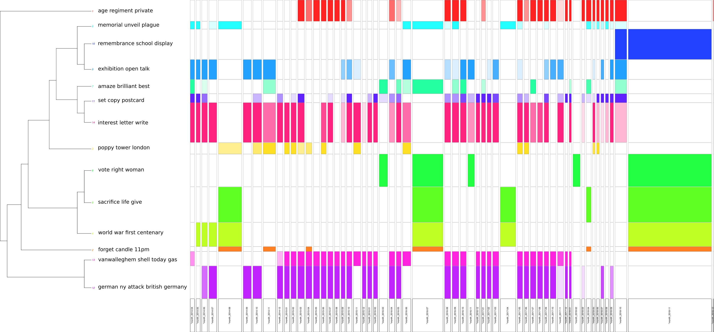

# <small>Introduction</small> the #ww1 project {data-background=img/background01.jpg}

## The WW1 Centenary and social media {data-background=img/background01.jpg}

The Centenary as the first large-scale commemoration in the era of social media

- Many initiatives involving a large audience
  - [*La grande collecte*](http://www.lagrandecollecte.fr/lagrandecollecte/?mode=desktop) (BnF / Archives nationales de France)
  - [Europeana 1914-1918](https://www.europeana.eu/portal/fr/collections/world-war-I) (implies British Library)
- Use of social media by museums
  - Léon Vivien (Musée de la Grande Guerre, Meaux)
- Databases onlin
  - [Morts pour la France](https://www.memoiredeshommes.sga.defense.gouv.fr/fr/article.php?larub=24)
  - [Commonwealth War Graves Commission](https://www.cwgc.org/)
  - [Volksbund Deutsche Kriegsgräberfürsorge](https://www.volksbund.de/home.html)

<aside class="notes">
</aside>
  
## The #ww1 project: harvesting data

- Twitter data only
  - Started 1st April 2014
  - Ended 1st December 2019

&rArr; One 11th November outside the Centenary

<aside class="notes">
But for this presentation, only 2014 through 2018.
</aside>

## The ww1 project: the state of the database

- 9,1 millions tweets
  - 2/3 of RTs - 1/3 of original tweets
- 1 million users

## 

{width=60% height=60% border=0}

## 

1. Methodology
2. Global overview
3. Unoriginal content, new practices?

# Methodology 

## Why Twitter?

Because we can.

- The Twitter Streaming API is *relatively* open
- Pieces of Software exist (analysis / harvesting),  relatively easy to use

## The technical dispositif

- PHP streaming API scripts: 140dev (2014-september 2017) / DMI-TCAT (September 2017-December 2019)
- «in-between» tools: basic text editors / spreadsheet software / OpenRefine / Dataiku DSS
- Analysis tools: IRaMuTeQ / Gephi

## The technical dispositif: IRaMuTeQ

Hierachical clustering

  - unsupervised
  - good old statistical method (1983 / French school of data anlysis)
  - clustering of segment of text and not words (in case of tweets: texts = segments of text = tweets)

<small>Reinert Max, « Les “mondes lexicaux” et leur “logique” à travers l’analyse statistique d’un corpus de récits de cauchemars », Langage et société 66 (1), 1993, pp. 5‑39. En ligne: <https://doi.org/10.3406/lsoc.1993.2632>; Ratinaud Pierre et Dejean S., « IRaMuTeQ : implémentation de la méthode ALCESTE d’analyse de texte dans un logiciel libre. », in: Modélisation Appliquée aux Sciences Humaines et Sociales, Toulouse, 2009. [En ligne]( http://repere.no-ip.org/Members/pratinaud/mes-documents/articles-et-presentations/presentation_mashs2009.pdf/view).</small>

## Questionning the corpus

- Where are Jean Jaurès, Georges Clémenceau and the battles of the Marne?
- the #lestweforget issue

# Global overview {data-background-image=img/background03.jpg}

## General temporality

## Linguistic temporality

## French corpus clustering...

## ...and its temporality

## English corpus clustering...

## ...and its temporality

# Unoriginal contents, new practices? {data-background-image=img/background04.png}

## Amteur historians: the #1j1p case

## Controversies: the commemoration of the battle of Verdun

## French historians on Twitter

# Conclusion

## General conclusions

## Digital bricolage

## The allure of the archive in the digital era

## Bibliography

## Pictures

- Monument aux Morts, Place de la République Strasbourg
- [Charles Seignobos](https://fr.wikipedia.org/wiki/Charles_Seignobos#/media/Fichier:Portrait_of_Charles_Seignobos.jpg)