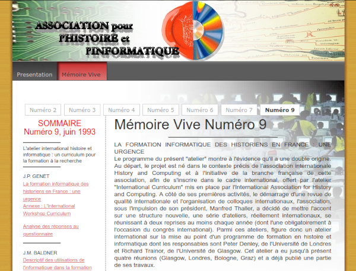
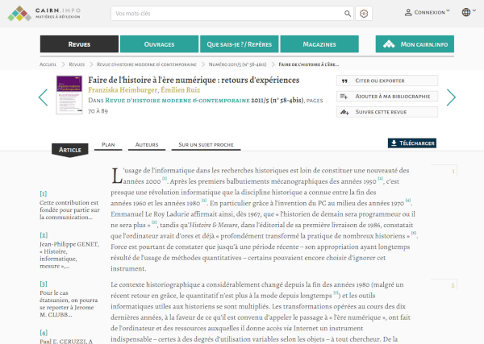
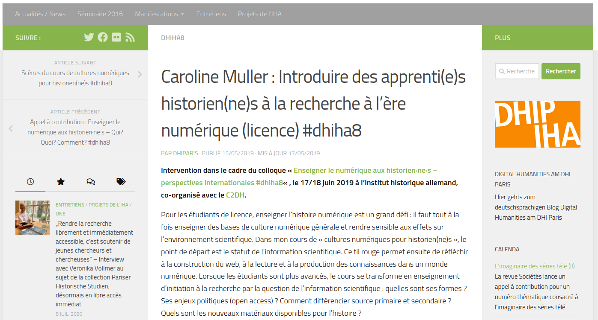
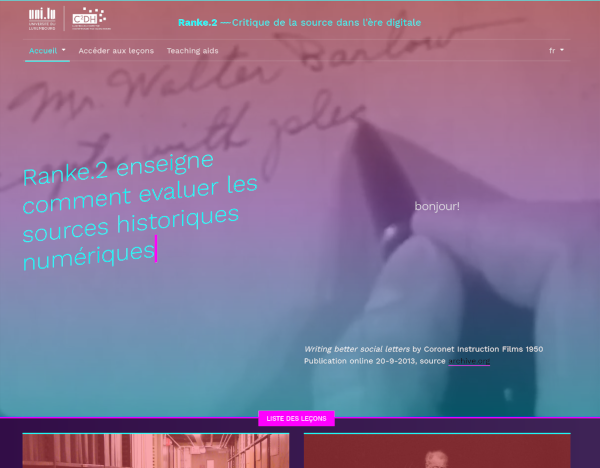
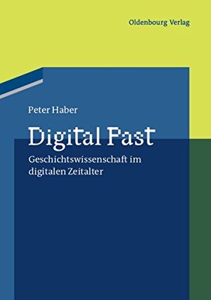
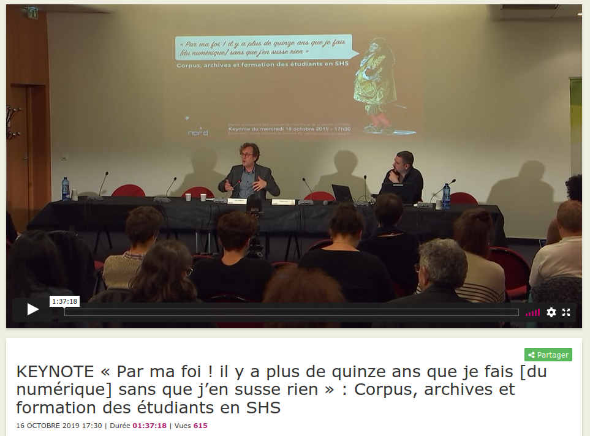
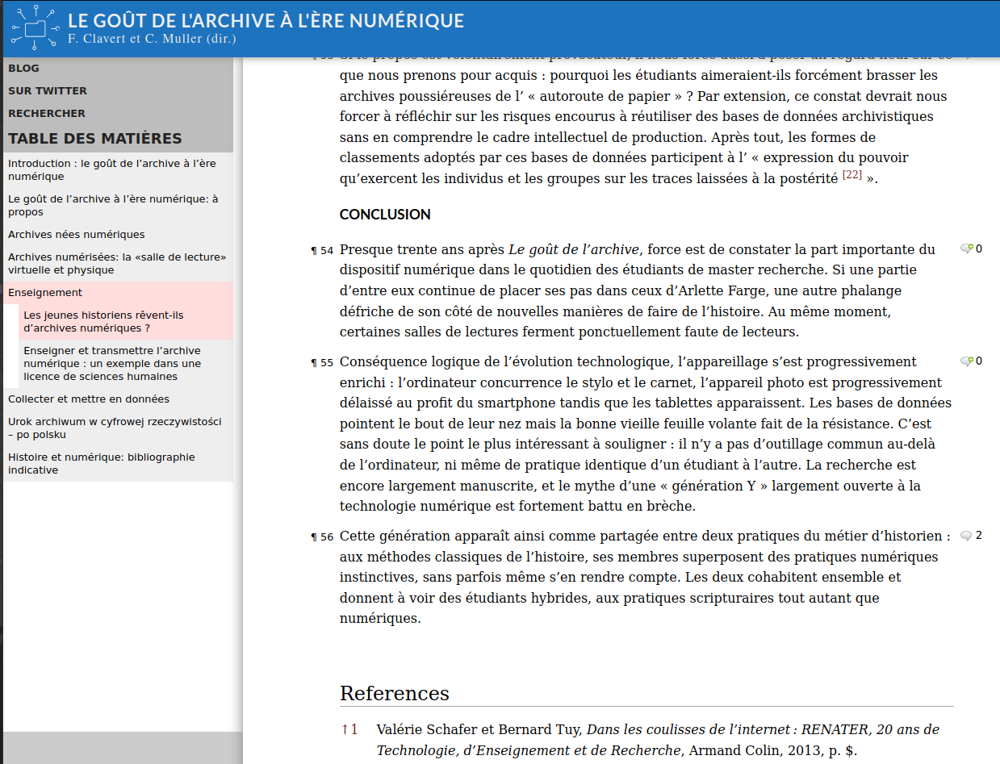

# L'enseignement de l'informatique en Histoire: une vieille histoire

##

##

##

## 

Évolution positive depuis 2011

Reims, Rennes, Lille... Luxembourg

# Un retour aux sources?

## 

##

## 

## Constats 

Prise de conscience de l'importance d'enseigner le «numérique» est ancienne. La notion de «source» y a toujours été présente.

Accélération et amélioration dans les dernières années, par la création de plusieurs cursus au niveau licence / master.

Fracture numérique reste bien là.

# Les enjeux de la critique historique des sources à l'ère numérique

## La question de la fracture numérique

Période de télescopage (transition?) entre un métier d'historien.ne comprenant un peu d'informatique et un métier d'historien.ne où toutes les étapes méthodologique comprennent du numérique.

Rappelle Doueihi: on passe de l'informatique au numérique soit une culture.

Mais cette «culture» n'est pas encore suffisamment explicitée.

## Résoudre la fracture numérique par les sources primaires

Passage obligé de l'enseignement.

L'enseignement de la critique des sources se fait indépendamment de l'apprentissage des compétences techniques «numérique».

Enseigner la critique des sources (enseignements dédiés ou non) de manière globale.

## Un exemple: Ranke 2.0

https://ranke2.uni.lu/

Collection David Boder: https://ranke2.uni.lu/u/boder/ 

## Une expérience à mener

*Digital memory studies*