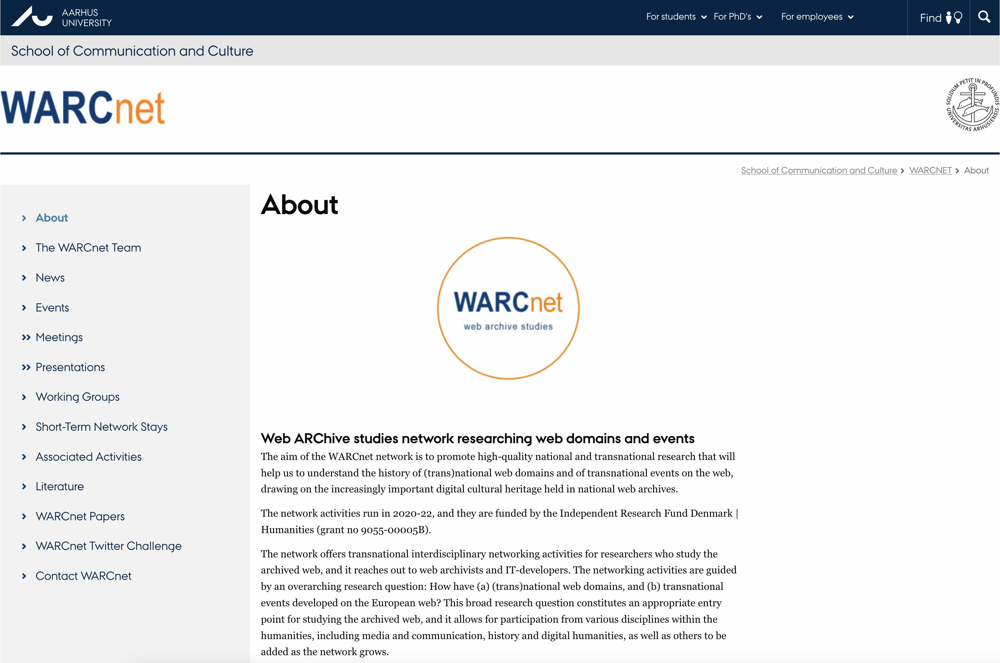
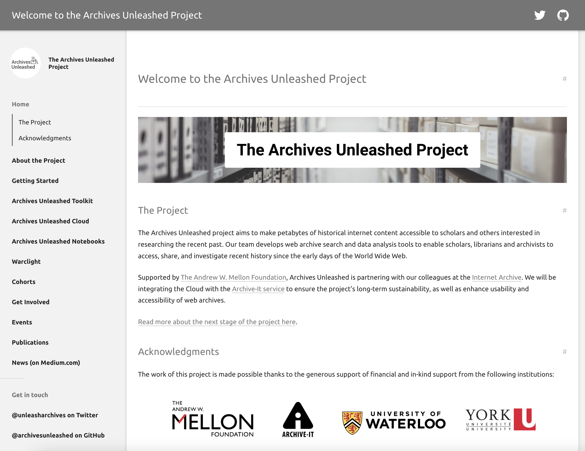
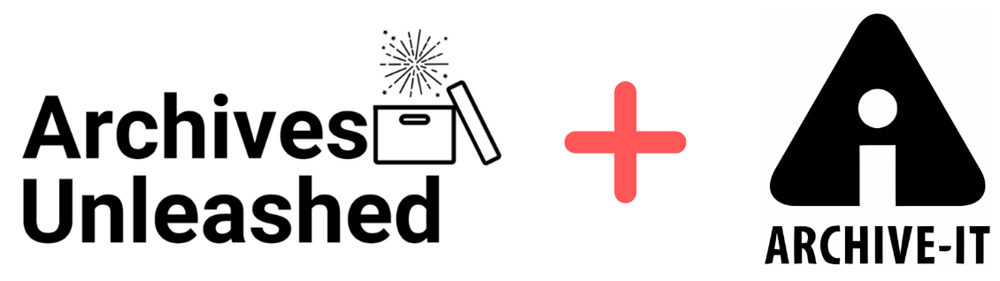
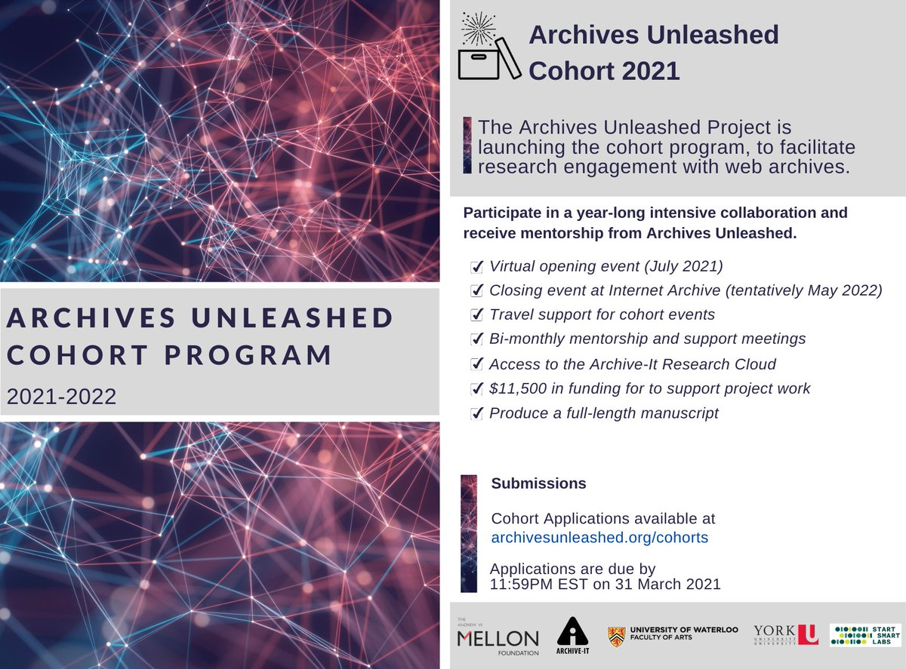
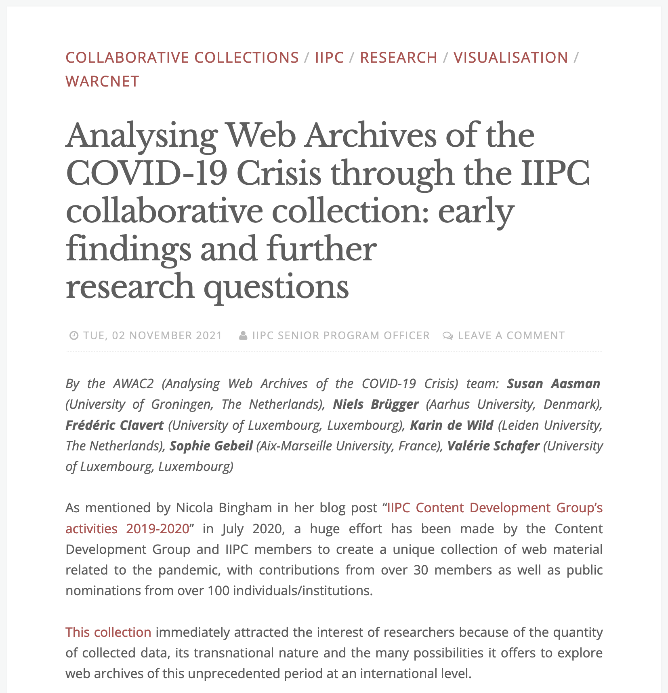

```{r setup, include=FALSE}
library(reticulate)
use_python("/usr/local/bin/python3")
knitr::opts_chunk$set(echo = FALSE)
```

# AWAC2 <br />Entre Europe, Canada et États-Unis

## WARCnet

**Web ARChive studies network<br /> researching web domains and events**

<style>
.container{
    display: flex;
}
.col{
    flex: 1;
}
</style>

<div class="container">

<div class="col" style="padding:5%; display: flex; justify-content: center; align-items: center">
<p style="font-size:15pt">The aim of the WARCnet network is to promote high-quality national and transnational research that will help us to understand the history of (trans)national web domains and of **transnational events** on the web, drawing on the increasingly important digital cultural heritage held in national web archives.</p></div>

<div class="col" style="padding:5%; display: flex; justify-content: center; align-items: center">

</div>
</div>


## [The Archives Unleashed Project](https://archivesunleashed.org/)


<style>
.container{
    display: flex;
}
.col{
    flex: 1;
}
</style>

<div class="container">

<div class="col" style="padding:5%; display: flex; justify-content: center; align-items: center">
<p style="font-size:18pt">The Archives Unleashed project aims to make petabytes of historical internet content accessible to scholars and others interested in researching the recent past.</p></div>

<div class="col" style="padding:5%; display: flex; justify-content: center; align-items: center">

</div>

</div>



## 



## WARCnet Working group 2:<br /> Analysing transnational events

<br />

> To create synergy, Working Group 2 will also investigate the relationship between the events and the different national web domains [...]


## COVID-19 comme événement transnational

<br />

- travail antérieur du WG2, notamment autour des *seedlists* des archives nationales
  - datathons internes
- travail d'enquête / d'entretien / d'histoire orale auprès de plusieurs bibliothèques nationales, de l'INA et de l'*International Internet Preservation Consortium*

<br />

&#8594; Pas d'accès aux données elles-mêmes

# Analysing Web Archives of the COVID Crisis (AWAC2)<br /><small>through the IIPC Novel Coronavirus dataset (Juillet 2021)</small>

## L'équipe 

- Valérie Schafer, University of Luxembourg (LU)
- Karin De Wild, Leiden University (NL)
- Frédéric Clavert, University of Luxembourg (LU)
- Niels Brügger, Aarhus University (DK)
- Susan Aasman, University of Groningen (NL)
- Sophie Gebeil, University of Aix-Marseille (FR)

> Investigating transnational events through web archive collections, the AWAC2 team will focus on a distant reading of the IIPC COVID-19 web archival collection to understand actors, content types and interconnectivity throughout it.

## Le corpus

<br />

- Coopération des membres de l'IIPC
  - Corpus hétérogène
- 4,9Tb de données 'brutes' (= fichiers WARC)
- 6,699,438 pages web
  - 'lignes' &#8594; certaines pages sont indexées plusieurs fois à plusieurs dates

## Domaines

<br />

```{r web_pages, echo=FALSE}
domain_frequency <- read.csv(file = 'data/domain-frequency.csv',nrows=50)
head(domain_frequency, 50)
```

## Accès au corpus

<!-- - Accès par Archive-it
- Pas d'accès aux fichiers WARC
- Accès à des fichiers CSV de différentes natures -->


## Les fichiers CSV

<small>

| Nom                     | Nature                                                                | Nb de lignes     |
|-------------------------|-----------------------------------------------------------------------|------------------|
| Domain Frequency        | Fréquence des domaines apparaissant dans la collection                | 161 757          |
|                         | **Informations sur les types de fichier**                             |                  |
| Audio Information       | Extraction des données audio et leur distribution par format          | 12 069           |
| Image Information       | Diverses informations sur les images, dont la distribution par format | 4 894 999        |
| PDF Information         | Diverses informations sur les PDFs                                    | 337 580          |
| PowerPoint Info.        | Diverses informations sur les présentations présentes dans le corpus  | 5                |
| Spreadsheet Info.       | Diverses informations sur les feuilles de calcul                      | 7 066            |
| Video Information       | Diverses informations sur les vidéos                                  | 64 571           |
| Word Document           | Diverses informations sur les documents issus de processeurs texte    | 139              |
|                         | **Fichiers Graph**                                                    |                  |
| Web Graph               | Liens entre les pages                                                 | 605 363 678      |
| Domain Graph            | Liens entre les domaines présents dans le corpus                      | 2 283 992        |
| Image Graph             | Liens entre les pages web par leurs images                            | 60 545 100       |
|                         | **Plain Text**                                                        |                  |
| Plain Text of webpages  | Le texte des pages                                                    | 6 699 438        |


</small>

## Défis méthodologiques et techniques (1)

<br />

### Un corpus massif

- Plain text: au-dessus du milliard d'occurrences
- Avec plus de 605 millions de liens, le web graph est massif
- Autres fichiers: Image Information, Domain Graph, etc

&rightarrow; Impossibilité d'utiliser les logiciels habituels

## Défis méthodologiques et techniques (2)

<br />

### Un corpus difficile à appréhender

- Éléments méthodologiques habituels des archives du web
  - cf. travaux de Niels Brügger, de Valérie Schafer, etc.
- Comprendre le corpus
  - issu de diverses sources nationales agrégées
  - quelle représentativité?
  - versions et copies

## Défis scientifiques

<br />

- Objectif du WG: l'étude des liens transnationaux.

- Quelles méthodes (collaboratives) de travail?

# Méthodes de travail

## Répondre aux défis (1)

<br />

- Élargir l'équipe &rightarrow; inclure un chercheur en sciences informatiques
- Passer des logiciels à interface graphique au développement de code *ad hoc*
  - Python / jupyter notebooks / GitHub
  
##
  


## 


## Répondre aux défis (2)

<br />

### Problème matériel

- Tout peut encore se faire sur certains de nos ordinateurs, mais au prix d'une très grande perte de temps
- L'optimisation du code permettrait sans doute de rester sur nos ordinateurs
- Une solution: passer au HPC pour la préparation et l'analyse de données

# Conclusion

##

- Sortir de sa zone de confort
- Mettre au point de «nouvelles» méthodes de travail collaboratif
- Le traitement du questionnement scientifique est fortement lié aux possibilités logicielles et matérielles auxquelles nous avons accès
  - Archives Unleashed &rightarrow; énorme progrès
  - Pouvoir télécharger les données est d'une très grande valeur, y compris pour utiliser les infrastructures de HPC

##


<a href='https://netpreserveblog.wordpress.com/2021/11/02/analysing-web-archives-of-the-covid-19-crisis-through-the-iipc-collaborative-collection-early-findings-and-further-research-questions/'></a>