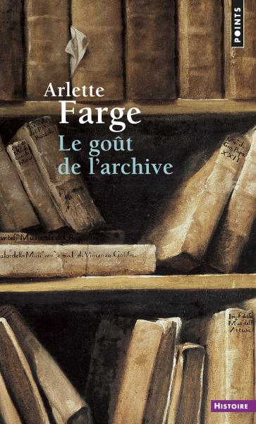
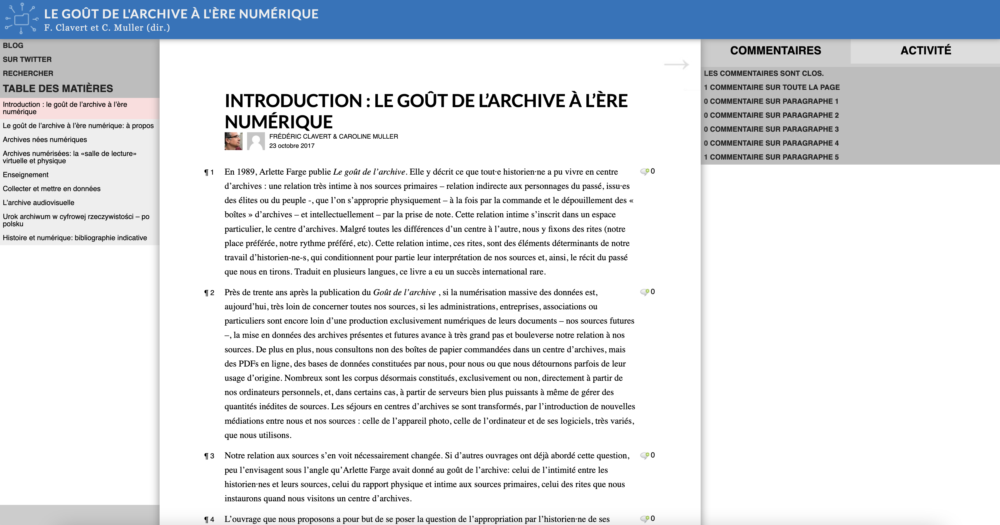
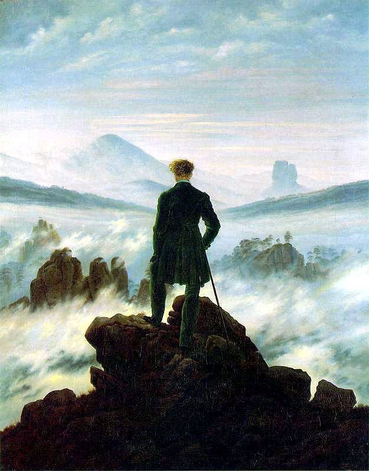
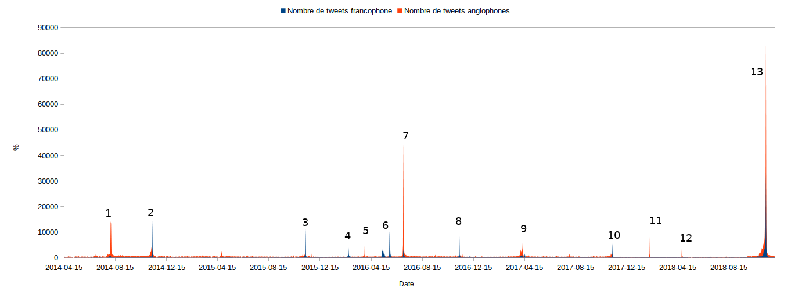
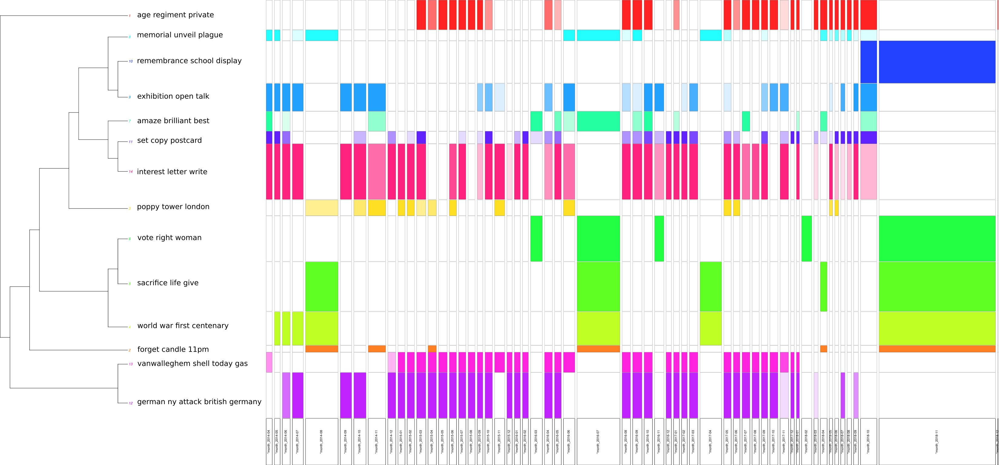
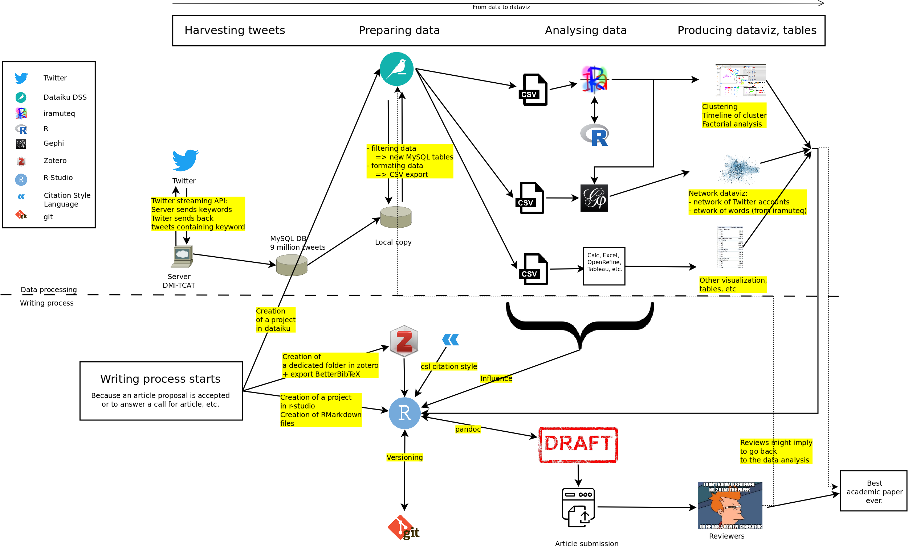
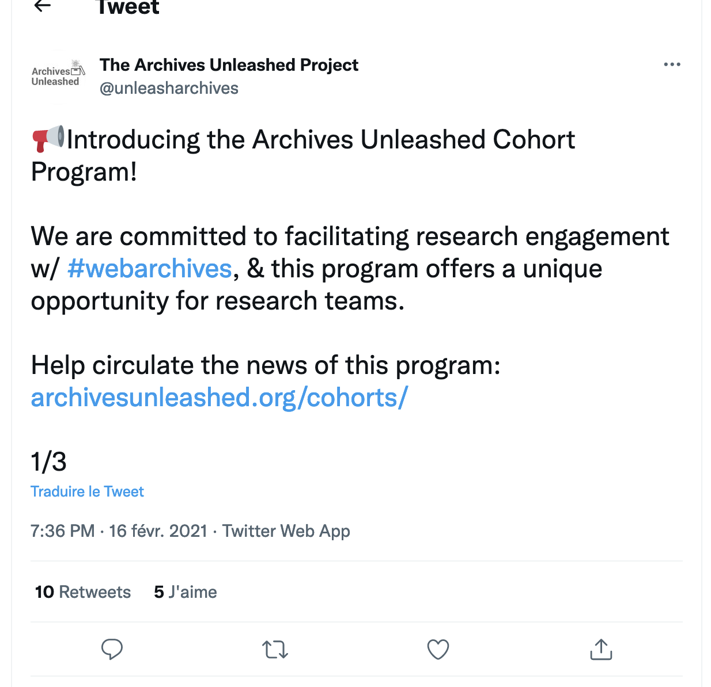
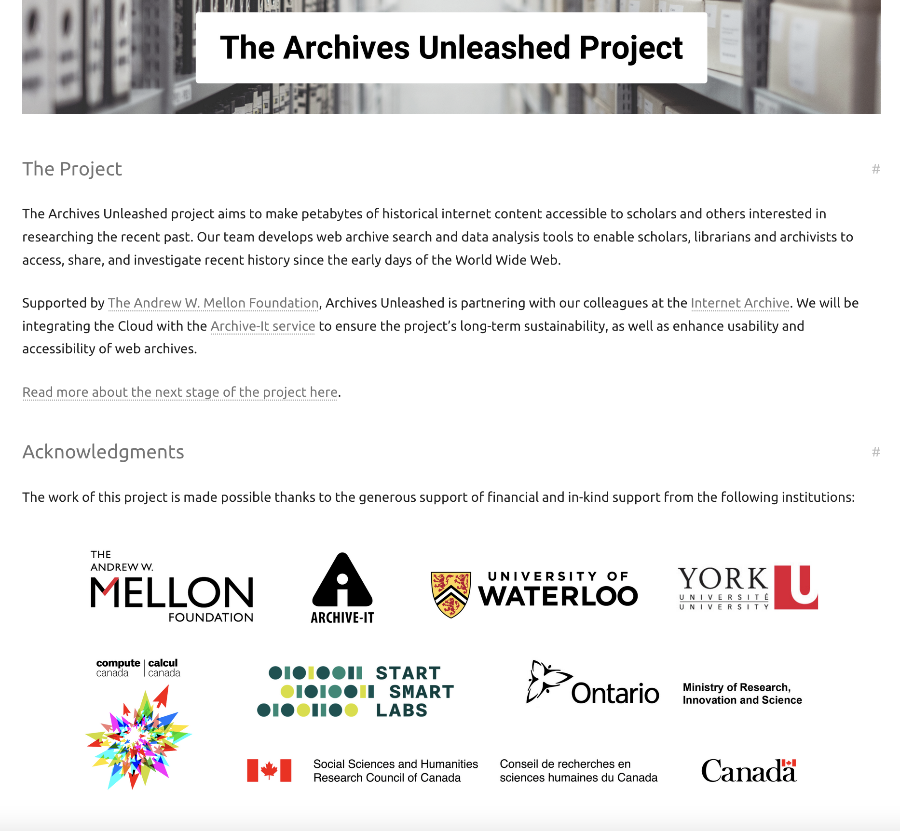
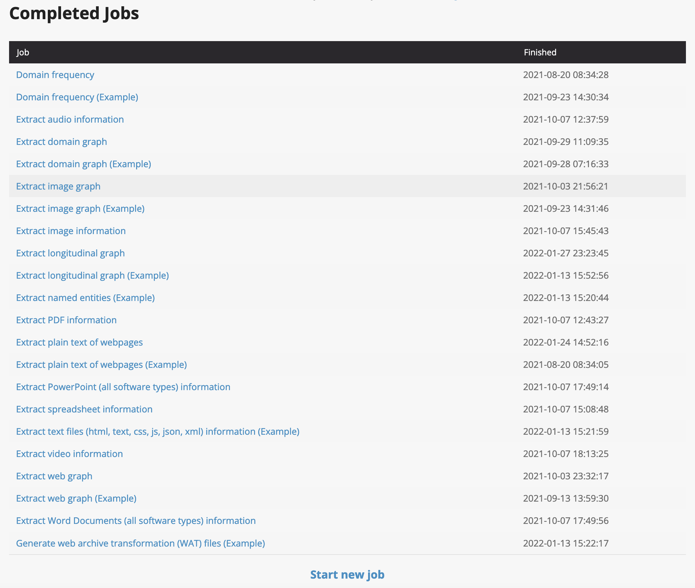

# Introduction {data-background='img/Prez_DH-13.png'}

<small>histoire des ri / bibliothèque numérique / lecture distante 
réseaux sociaux numériques et centenaire de la Grande Guerre / covid19 (rsn - archives du web) 
goût de l'archive à l'ère numérique</small>

## Du goût de l'archive... {data-background='img/Prez_DH-13.png'}

## ...au goût de l'archive à l'ère numérique {data-background='img/Prez_DH-13.png'}

## Quelques éléments issus  du Goût de l'archive à l'ère numérique {data-background='img/Prez_DH-13.png'}

- Les pratiques "discrètes" des historiens et historiennes (CulturHIST)
- La question du bricolage

## Bricolage numérique? {data-background='img/Prez_DH-13.png'}

*La pensée sauvage* (1962), Claude Levi- Strauss

## {data-background='img/Prez_DH-13.png'}

Bricolage numérique comme réponse (universitaire) à la *disruption* technologique.

*comment continuer sa recherche alors que les outils, les méthodes et même les sources primaires (dans leur forme et leur volume) évoluent rapidement alors même qu'il n'est plus possible de lire (et comprendre) la littérature que nous devrions lire (et comprendre)?*

## {data-background='img/Prez_DH-13.png'}

Implications concrètes importantes

- Quel outil choisir, comment l'utiliser, comment connaître ses limitations?
- Comment comprendre ses propres limitations techniques, méthodologiques et épistémologiques?
- Quels modes d'appropriation de ces outils dans les sciences humaines et sociales?

## Trois projets {data-background='img/Prez_DH-13.png'}

- #ww1 - le Centenaire de la Grande Guerre sur Twitter
- AWAC2
- Journal of Digital History

# #ww1 - Le centenaire de la Grande Guerre sur Twitter {data-background="img/Prez_DH-16_trans.png"}

## Origines du projet {data-background="img/Prez_DH-16_trans.png"}

- Un savoir-faire qui rencontre une question de recherche
- Le Centenaire

## Différents outils utilisés {data-background="img/Prez_DH-16_trans.png"}

- Collecte avec des scripts sur serveur personnel, puis professionnalisation (Lausanne et Luxembourg)
    - Sur base de mots-clés / hashtags
- Les logiciels de l'entre-deux
    - tableurs
    - le volume augmentant: Dataiku DSS 
- Analyse
    - IRaMuTeQ
    - Gephi

## Descriptif du corpus {data-background="img/Prez_DH-16_trans.png"}

- 9 millions de tweets (Avril 2014-Décembre 2019)
- 1,5 million d'utilisateurs
- De 75 à 80 % de retweets

## L'historien·ne face à une mer de données... {data-background="img/Prez_DH-10_trans.jpeg"}

    
## Scalable reading {data-background="img/Prez_DH-10_trans.jpeg"}

Multiplier les échelles de la lecture, de la lecture proche à la lecture distante.
    
## Analyses {data-background="img/Prez_DH-16_trans.png"}

##

##

##

##

##

##

##

##  Transformation radicale des pratiques (recherche, écriture) {data-background="img/Prez_DH-10_trans.jpeg"}

## Quel historien suis-je? {data-background="img/Prez_DH-10_trans.jpeg"}

# AWAC2 {data-background="img/aarhus.png"}

## Analysing Web Archives of the COVID Crisis   through the IIPC Novel Coronavirus dataset {data-background="img/awac2.png"}

## {data-background="img/awac2.png"}

## {data-background="img/awac2.png"}

- Projet collectif (WARCnet)
- Corpus d'archives du web 
- Résultat d'une coopération au sein de l'IIPC
    - Corpus hétérogène
    - Critères de collecte peu sûrs
    
## Description du corpus {data-background="img/awac2.png"}

- 5,3 Tb
- 8 738 751 pages web

## Accès {data-background="img/awac2.png"}

- Archive It
- Archive Unleashed toolkit

AUT permet l'extraction de nombreux sous-fichiers

## {data-background="img/awac2.png"}

## La routine déroutée {data-background="img/awac2.png"}

- Les méthodes et savoir-faire développés pour #ww1 ne fonctionnent plus
- Trop de données

## Quelles méthodes mettre au point? {data-background="img/awac2.png"}

- Vers les notebooks
- GitHub pour le collaboratif
- Utilisation des infrastructures HPC de l'université
- Coopération avec nos collègues de sciences informatiques

## Quel historien suis-je? {data-background="img/awac2.png"}

# Journal of Digital History {data-background="img/fingerprint.png"}

## {data-background="img/fingerprint.png"}

- Comment permettre à des chercheurs et chercheuses en histoire utilisant des méthodologies similaires de publier dans de bonnes conditions?
- Comment valoriser le code, les données, les méthodes et non uniquement les résultats?

[Journal of Digital History](https://journalofdigitalhistory.org)

# Conclusion {data-background='img/Prez_DH-13.png'}

## {data-background='img/Prez_DH-13.png'}

- Pratiques, méthodes, écriture de l'histoire... évoluent quasiment à chaque projet
    - Fonction de la nature des sources primaires
    - Fonction de leur volume
- Aucune routine ne peut être mise en place
- D'où la pertinence de la notion de *digital bricolage*

## {data-background='img/Prez_DH-13.png'}

- Instabilité constante du métier d'historien·ne pour certains types de recherche
- Fossé grandissant au sein du milieu des historien·ne·s
    - MAIS... touche tou·te·s les historien·ne·s (pratiques discrètes)
 
Comment prendre en compte ces éléments dans la formation des historien·ne·s?

