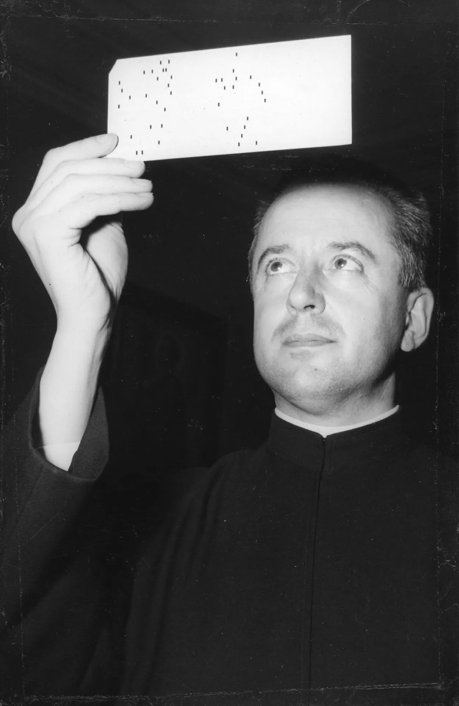
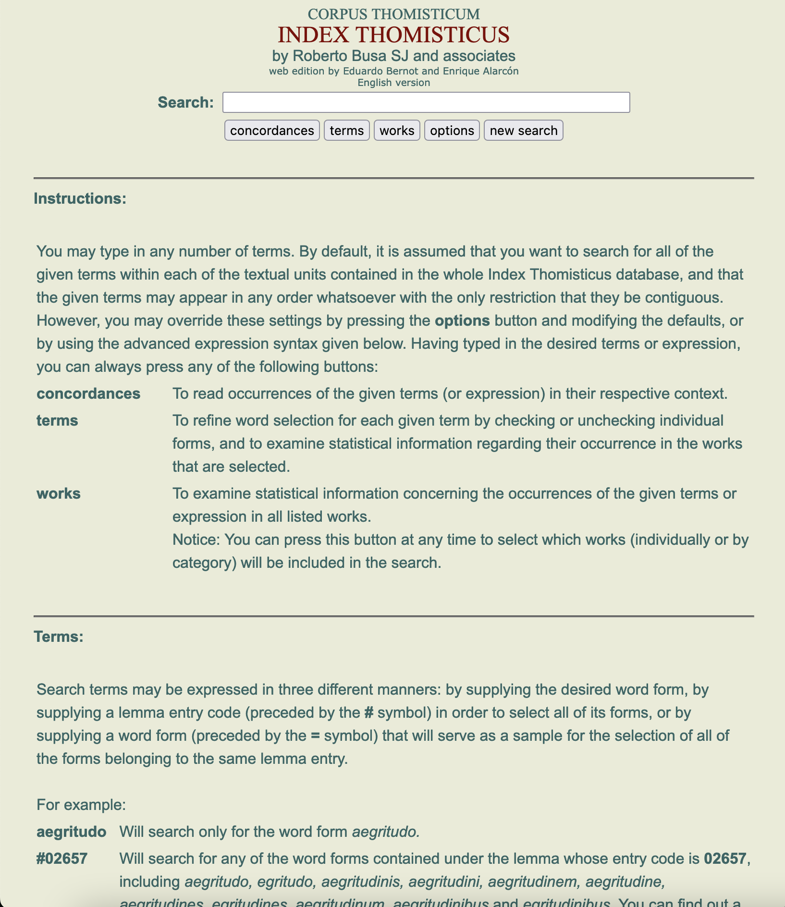

# Que sont les Humanités numériques ? {data-background=img/vagues_trans.png}

##  {data-background=img/vagues_trans.png}

> Digital humanities (DH) is an area of scholarly activity at the intersection of computing or digital technologies and the disciplines of the humanities. It includes the systematic use of digital resources in the humanities, as well as the analysis of their application. DH can be defined as new ways of doing scholarship that involve collaborative, transdisciplinary, and computationally engaged research, teaching, and publishing. It brings digital tools and methods to the study of the humanities with the recognition that the printed word is no longer the main medium for knowledge production and distribution.

# L'histoire des Humanités numériques: des jalons inévitables {data-background=img/busa_trans.png}
  
## Thomas J. Watson et Roberto Busa (1948) {data-background=img/busa_trans.png}
  
</img>

## index thomisticus {data-background=img/busa_trans.png}
  
-	le projet de Busa aboutit en 1980 
- 70 000 pages sur 56 volumes 
-	Porte sur l'ensemble des mots des la *Somme théologique*
 
</img>

## Le rôle de la linguistique computationnelle {data-background=img/darpa_trans.png}
  
- La portée des travaux de Busa touche en premier lieu la linguistique 
- Le lien: le rapport au texte 
- Naissance de la lexicométrie

## La structuration associative {data-background=img/darpa_trans.png}

- Association for Computational Linguistics  (1962, 1968) 
- Association for Literary and Linguistic Computing  (ALLC, 1973, London), puis *European Association for Digital Humanities* 
- Association for Computers and the Humanities  (1978, USA) 

**Co-organisent une conférence annuelle dès les années 1970.**

## La création de LLC  {data-background=img/darpa_trans.png}
 
 

- *Literary and Linguistic Computing* 
- Issu des différents Bulletins de ALLC 

## Text Encoding Initiative {data-background=img/tei_trans.png}
  
Fondée par ALLC, ACH, ACL (1987)

- Rôle central du texte dans les sciences humaines et sociales 
- Rôle de la linguistique dans les Humanités numériques 

## Des *Humanities computing* aux *Digital Humanities* {data-background=img/companion_trans.jpg}

- 2004: *A Companion to Digital Humanities*
-	Associations se regroupent au sein d'ADHO (*Alliance of Digital Humanities Organisations*) 
-	ALLC devient EADH
- LLC devient *Scholarship in Digital Humanities* 
- Création (ADHO) de *Digital Humanities Quarterly*

## Digital Humanities? {data-background=img/companion_trans.jpg}
 
- Micro-informatique 
- Internet 
- Numérisation 

**L'émergence d'un monde de données**

**La diversification des disciplines touchées**

## Un exemple de structuration: le cas de la France {data-background=img/manifeste_trans.jpg}

- Des disciplines qui usent de l'informatique depuis longtemps 
- Des tentatives de structuration disciplinaires par exemple en histoire (l'expérience de *Mémoire Vive* dans les années 1990) 
- THATCamp Paris 2010 (et suivants) et le Manifeste des *Digital Humanities* 
- Création de *Humanistica* (ADHO)
 
## Une histoire qui arrange tout le monde? {data-background=img/busa_trans.png}
 
- La dernière génération en activité qui a connu Busa (mort en 2013)
  - les citations de Busa explosent dans les années 1980 (Google Scholar)
- Des critiques qui utilisent certains de ces jalons
	- Éric Guichard et Busa (« [Les Humanités numériques n'existent pas](https://hal.archives-ouvertes.fr/hal-02403315) »)
	- Allington, Daniel, et al. <a href="https://lareviewofbooks.org/article/neoliberal-tools-archives-political-history-digital-humanities/" target="_blank">« Neoliberal Tools (and Archives): A Political History of Digital Humanities » . Los Angeles Review of Books, janvier 2016. 
	- « [Critique des humanités numériques](http://journals.openedition.org/variations/782) » , *Variations* (2016:19)
	 
## {data-background=img/busa_trans.png}

> [...] l’ancêtre que les humanités numériques se sont choisies est un bon père : un jésuite, Roberto Busa, qui a sollicité le patron d’IBM pour réaliser la concordance de l’œuvre de Thomas d’Aquin en 1949. À l’heure de la mondialisation et de la critique du capitalisme numérique, nous nous serions bien passés de l’imposition d’une telle paternité.

# Un regard critique sur cette histoire {data-background=img/darpa_trans.png}

## Le mythe Busa {data-background=img/busa_trans.png}
 
Busa ne travaille pas seul.

- l'index est issu d'une réflexion menée pendant sa thèse
- l'usage des *mainframes* de l'époque impliquait, pour la préparation des cartes perforées, l'emploi de nombreuses employées (dans ce cas-ci) avec les conditions de travail réservées aux jeunes femmes de l'époque en Italie  (Julianne Nyhan)
- Renvoie au *digital labour* d'aujourd'hui

## Le mythe IBM {data-background=img/watson_trans.jpg}

Pourquoi IBM s'intéresse-t-il à un théologien / philosophe du XIII<small>e</small> siècle? (Steven E. Jones)

- La restructuration de la recherche après la Seconde Guerre mondiale 
- Quel marché en Europe pour IBM et ses machines? 
- Humanisation de la machine 
- Guerre froide 

## Des disciplines « oubliées » {data-background=img/longue_duree_trans.png}
 
**L'exemple de l'École des Annales**

- Narration classique où l'école des Annales est peu (pas) mentionnée.

MAIS deux classiques (relativement) « récents » la mettent en avant:

  - *Graphs, Maps and Trees* (Franco Moretti, Verso, 2007)
    - approches quantitatives des années 1960
  - *The History Manifesto* (Guldi, Armitage, Cambridge University Press, 2014)
    - Braudel et la longue durée

## Des racines plus anciennes {data-background=img/longue_duree_trans.png}

 

- Articles dès la fin des années 1950 sur l'usage de la « mécanographie »
  - rôle d'*Euratom* dans les usages informatiques des historiens et historiennes

- Influence des Annales sur la linguistique computationnelle
  - modèle d'acculturation au quantitatif
  - avec la cliométrie

## Europe de l'Ouest et Amérique du Nord... {data-background=img/brejnev_trans.jpg}
 
**une histoire des DH marquée par la Guerre froide**

Que se passe-t-il à l'Est?

- Hannu Salmi, *What is Digital History?*
  - 1971, Estonie: discussion sur l'usage de l'informatique en histoire
- Probablement faudrait-il fouiller d'éventuelles réflexions en Inde dès cette époque

# Conclusion:  l'histoire en train de s'écrire d'une communauté de pratiques {data-background=img/manifeste_trans.jpg}

## {data-background=img/manifeste_trans.jpg}

 

- Le travail historique est toujours un travail en cours, en train de se faire
- Il dépend des sources, il dépend aussi parfois des générations
- L'histoire des Humanités numériques est exemplaire de la démarche des historiens et historiennes

## Vers une intégration... {data-background=img/manifeste_trans.jpg}

**...de ceux et celles que l'on a négligés**

- le travail invisible des femmes (et des professions, féminisées ou non, d'aide à la recherche)
  - important aussi pour une réflexion sur les usages actuels de l'apprentissage machine dans les Humanités numériques
- les zones géographiques jusqu'ici peu abordées par les publications sur l'histoire des Humanités numériques
