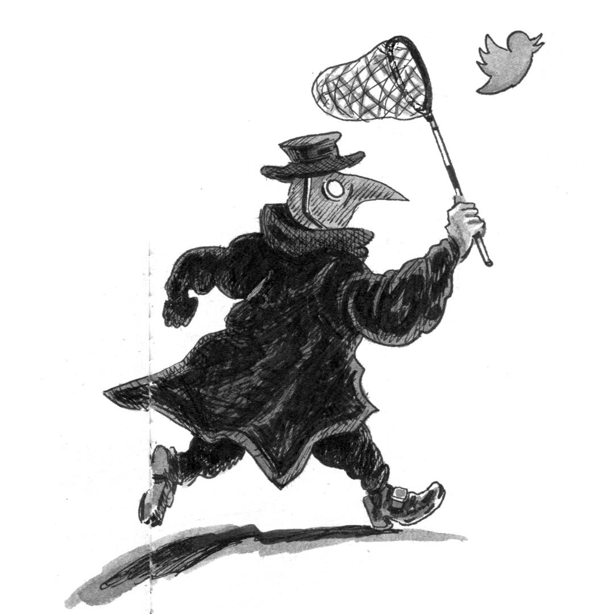
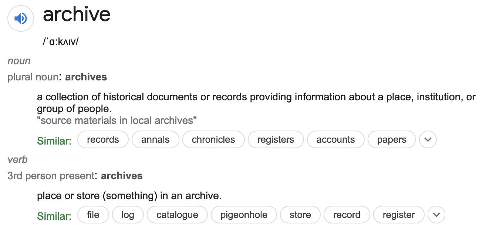
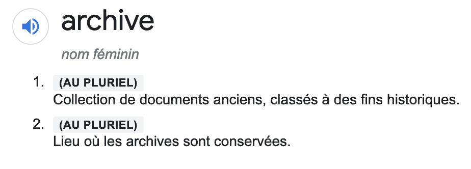
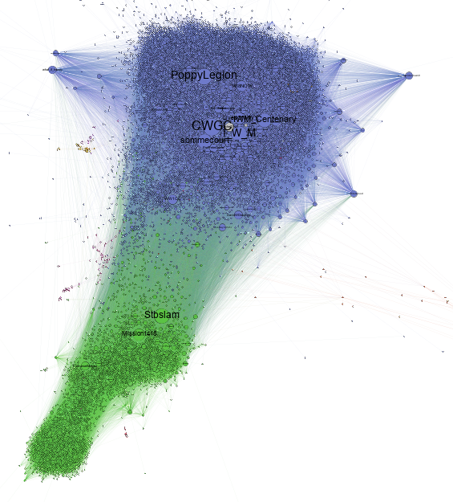
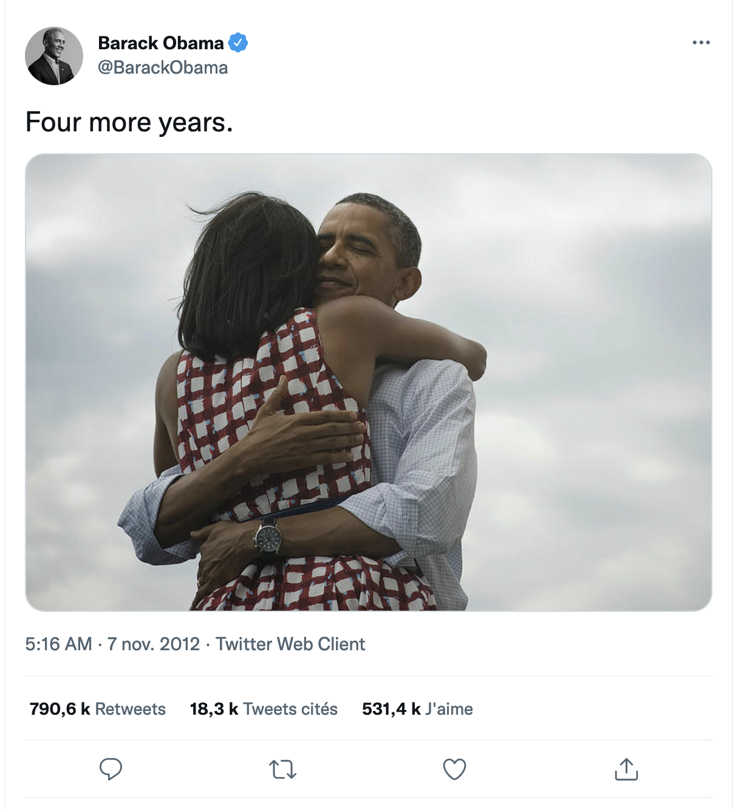
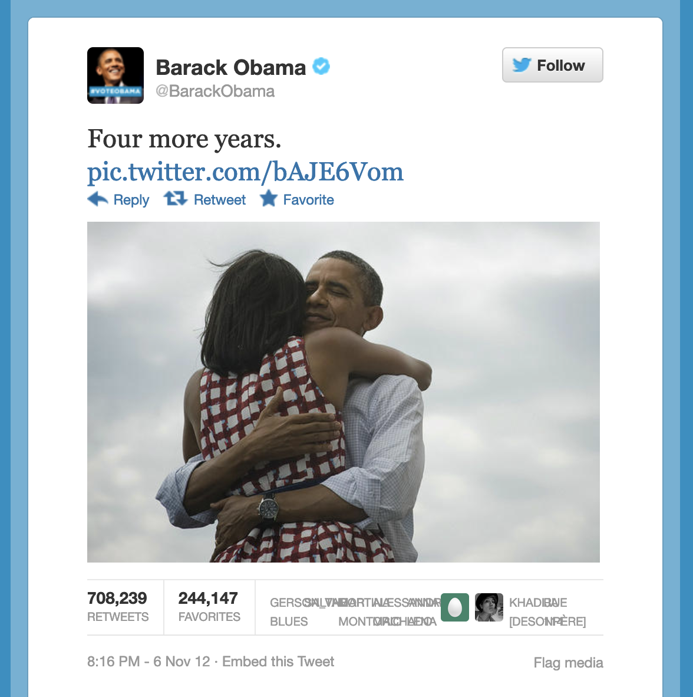

## {data-background=img/Strasbourg_bg.jpg}

historian / #ww1 / #covid

<em>illustration: projet esch-mars / simon beuret</em>

# archives? {data-background=img/archives_bg.jpg}

## archives? (in french) {data-background=img/archives_bg.jpg}

## archiving as the setting of hisorians' work {data-background=img/foucault_bg.png}

preserving / sorting / indexing

## primary sources and archives

 

all archives are primary sources

all primary sources are not necessarily archives

## tweets as primary sources {data-background=img/twitterAPI_bg.jpg}

- twitter's api as a way to get primary sources, not archives
- twitter's api as settings of a researcher's work

## api as settings of the historians' work {data-background=img/twitterAPI_bg.jpg}

is there an api? / what are the conditions to use the api? / sustainability of the api

# researching echoes of the past on twitter {data-background=img/hashtags_bg.png}

\#ww1 (api 1.1)

\#covid (api 1.1, apiv2)

## \#ww1 and the echoes of the centenary of the first world war online {data-background=img/hashtags_bg.png}

- 2014-2019
- 9 million tweets
- 1.5 Twitter account

## api as a framework {data-background=img/darpa_bg.png}

- twitter streaming api (v1.1)
- anticipation
- no going back

## some results

## 

## 

# covid19 on twitter {data-background=img/schnabel_bg.png}

- with Deborah Paci
- massive harvesting of tweets, first in french, then in italian too (comparison)
- started with a harvesting of the same nature as the \#ww1 project
- 2021: API v2

## new api, new framework... {data-background=img/darpa_bg.png}

- 10 million tweets
- history of twitter
- are we closer to an archive?

## ...and other limitations {data-background=img/darpa_bg.png}

# working on archived tweets {data-background=img/archives_bg.jpg}

## what would be the point? {data-background=img/archives_bg.jpg}

- I work with CSVs, JSONs not with what you actually see, read on twitter
- the environment of a tweet is not historicized if you use the API

## an example: Obama's '4 more years' tweet {data-background=img/archives_bg.jpg}

## and in 2012 (wayback machine) {data-background=img/archives_bg.jpg}

# as a conclusion: how to **really** historicize twitter? {data-background=img/clio_bg.png}

## images credits

- [Strasbourg, Monument aux morts, Claude Truong-Ngoc, CC BY SA 3.0](https://commons.wikimedia.org/wiki/File:Strasbourg,_monuments_aux_morts.jpg)
- [archive-background](https://commons.wikimedia.org/wiki/File:Pennsylvania-_BUTLER_County,_Enumeration_District_59,_Sheet_No._17A_-_DPLA_-_eccfb4850628b48b6a9f9ec02eb65015.jpg)
- [Les archives Foucault à l'ère du numérique](https://bnf.hypotheses.org/9563)
- [TwitterDev](https://twitter.com/TwitterDev)
- [Car of History Clock - US Capitol](https://www.flickr.com/photos/uscapitol/6777319298/)
- [DARPA big data vizualisation](https://bigdatafinance.eu/two_positions_available/big-data-darpa/)
- Paul Fürst, Der Doctor Schnabel von Rom. 1656.
