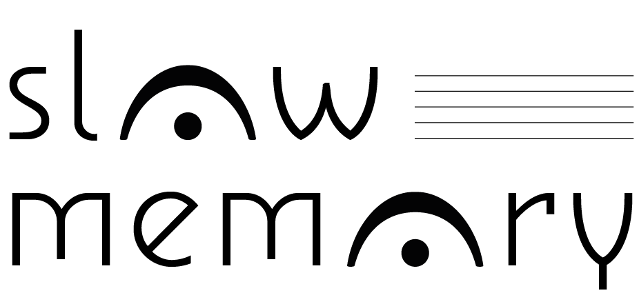
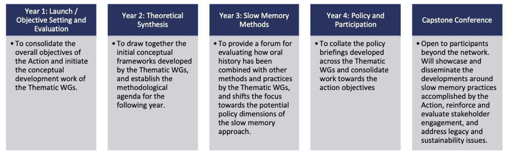

# memory studies

  

???

Today's seminar aims at informing you about a COST action project and maybe at finding people who would be interested in participating in it.

Indeed, it will be more about a project than about a concept.

I must also precise that I am obviously out of my confort zone, here -- there's few about tweets, AI or tweets about AI.

--
- a rather recent field of research (memory boom, 1980s)

--

- structured around the *Memory Studies Association* (2017) and <a src="https://journals.sagepub.com/home/mss">*Memory studies*</a> (2008)

--

.footnote[<small>Olick Jeffrey K, Sierp Aline et Wüstenberg Jenny, « <a name='https://doi.org/10.1177/1750698017721792'>The Memory Studies Association: Ambitions and an invitation</a> », Memory Studies 10 (4), 10.2017, pp. 490‑494.</small>]

???

If you allow me a side remark, an interesting research would be to compare memory studies and digital humanities -- both are relatively young disciplines or communities and the way they structured in the last 20 years.

Both can, by the way, have elements in common -- see Hoskins's Digital Memory studies or Joanne Garde Hansen's work. I am still thinking a bit about how to work on that at the C2DH -- including setting up a JDH special issue. Don't hesitate to contact me if interested.

---

## an observation

  

--

- *Memory studies* focused on trauma, wars, atrocities

???

See Andreas Huyssen's or Henry Rousso's work about the collective memory of the Holocaust as a framework for the globalization of memory (Holocaust as a universal trope for historical traumas, Huyssen).

--

- Idea that memory is something fluid\*, but still based on trauma

.footnote[<small>\* Erll, Astrid. 2011. *Travelling Memory*. parallax 17 (4): 4-18.</small>]

--

  

> The key contribution of memory studies has been to help us understand how key historical events serve as unique anchors for communities, pivotally shaping collective identity and contributing to democratisation and reconciliation (SlowMemo Prop.)

---
background-image: url("img/uneven_bg.png")
background-position: center

## how to grasp what is eventless, multi-sited, slow-moving?

   

 

<em>Transformative Practices for Times of Uneven and Accelerating Change</em>

---

# slow memory

--
- **how to assess**, understand, individuals' and communities' responses to "slow-moving" and dispersed change?

--

- **aim:** broader understanding of (collective) memory.

???

« to trigger a new discovery phase in memory studies by providing a platform for incubating networked, transnational, multidisciplinary research that engages systematically with the insights of environmental science, indigenous epistemologies, peace studies, and political economy. »

--

- **assumptions:**  whether societies can build resilient answers to grand-scale transformations depends fundamentally on their practices of remembrance.

???

This Action adopts a more fundamental approach by seeking to understand the long-term structural transformations as a crucial underpinning for memory politics, as we argue that they are pivotal to peoples’ everyday experience. Practices of remembering and commemoration are then deeply interwoven with how communities understand and manage their place in these emerging and decisive transformations. 

--

  

<em>climate change, deindustrialization, neoliberal transformations of states and societies</em>

---

## resurfacing the past

At the centre of the concept, the notion of *daylightning*

???

daylightning comes from the environmental sciences. When you try to unearth, for instance, former or underground riverbeds.

--

  

> [daylightning] highlights the need to unearth and reclaim forgotten and marginalised pathways in order to forge resilient approaches to current challenges. [...] Memory work resurfaces the past, it requires creativity and labour to build shared narratives and cultural values, involving deep listening and critical reflection. (slow memo prop.)

---

## 'lieux de mémoire' / 'milieux de mémoire'

--

- Halbwachs: 'milieux de mémoire'
  - memory depends on the social space of specific "milieux"\*

.footnote[<small>\* Gensburger Sarah, « <a src="https://doi.org/10.1177/1468795X16656268">Halbwachs’ studies in collective memory: A founding text for contemporary ‘memory studies’?</a> », Journal of Classical Sociology 16 (4), 11.2016, pp. 396‑413.</small>]

--

- Nora: rising individualism
  - how a community can anchor its memory?
  - lieux de mémoire

--

  

> the focus needs to move from the sites to the milieux of memory, trying to grasp the everyday dynamics of memory with their contradictions and complex manifestations. (slowmemo prop.)

---

## a critical point of view

  

> The European Union has understood the need for a political community to have a common memory. Thus, the House of European History is centred around the negotiation of the key events and ideologies of the twentieth century - though it has seen a fair share of challenges and counter-projects. The Action suggests a different approach: what if we regard the navigation of environmental decline, post-industrial restructuring, the transformation of the welfare state, and neoliberal economics as THE shared experience of Europeans?

---

# COST Actions 

- Networking activities

- All COST countries can join, with two representants by country
  - Luxembourg: Elisabeth Boesen & myself.
  
- Currently: 38 (40) countries

- Started in October 2021

- Conference on the Isle of Portland last June
  - next one in Aarhus (12-16 june) + training school

---

## Leadership team

[slowmemo website](https://www.slowmemory.eu/participants/)

---

## CA SlowMemo: Structure

Transformation of

--

- Work,

--

- Welfare,

--

- Politics,

--

- Conflict

--

- Environment.

--

and two complementary working groups:
--
 **capacity building and learning**, 
--
**communication and dissemination**.

---

## other ways to work and methods

--

- slowing down / slow research\*

.footnote[<small>\* Ghosh, Amitav. 2020. '<a src="https://www.thehindu.com/books/what-we-have-to-think-about-above-all-is-how-to-slow-down-amitav-ghosh/article31414696.ece">What we have to think about, above all, is how to slow down</a>'. The
Hindu*. April 25.</small>]

--

- co-production with stakeholders / communities

???

- common with public history
- ex: Isle of Portland conference was organised with Portland inhabitants, who contributed through their extincted species memorial project  

--

- oral history 
 
 

---

### Transformation of Work

???

- decline of large-scale industry and the changing nature of the modern workplace,
- significant effects on local communities and on individuals’ life perspectives.
- question of neoliberal politics and (de)regulatory regimes
- facilitation of populist mobilisation / linked to memory politics

*how remembrance practices can make visible economic transitions that are experienced unevenly and gradually.*

Economic restructuring is intertwined with new (de)regulatory regimes and a neoliberal politics that entail a distinct framing of temporality and the meaning of the past. These developments have sometimes shut down traditions of working-class solidarity, while facilitating populist mobilisation with new (and old) kinds of memory politics.

The reverberations of these trends are felt locally and nationally, and can be fruitfully compared across a wide variety of cases. We regard a comparative and transnational understanding of the local manifestations of socio-economic transformation as an indispensable underpinning to the Action.

Methodological approaches to economic modelling and trends will be brought into dialogue with oral history techniques to develop new modes of narrating and visualising socio-economic change. This theme will also work to build a platform with post-industrial communities to articulate, maintain and understand their past as a critical continuity. This will enable memory politics, so often the source of problems and tension, to become a force for constructive engagement and policy action. The transnational perspective will be maximised to share best practices, track labour markets and encourage the de-insularisation of perspectives. The key stakeholders here will be trade unions and community organisations.

---

### Transformation of Welfare

???

- “austerity” measures and welfare state 
- rising inequalities

profound restructuring of how the most vulnerable members of society are treated.

This theme seeks to inform current practices and attitudes towards social care via a reconnection to past experiences.

will use slow memory concepts within a co-production model to articulate the lived experience of welfare transitions.

A particular concern will be to overcome the division between academic knowledge and expertise through experience developing a dialogic practice through which knowledge is developed and transmitted through service user networks and organisations can be mobilised and made central to debates around slow memory.

These transformations and the rising inequalities to which they have given rise are mediated through practices of remembering and shape the future aspirations of community members. Of particular concern for this Working Group is the dispersion of care into complex relations between local agencies (e.g. community mental health care; interagency work in children’s services) and the ways in which this reconfiguration risks a relative erasure of memory and the capacity for lived experiences of care to be retained and commemorated. Experience with institutions of the welfare state are ubiquitous, but the ways in which they are remembered must be resurfaced and newly understood. This theme seeks to inform current practices and attitudes towards social care via a reconnection to past experiences.

Engagement with and collaborations between users and care leavers (past, present and future) across the various areas to be studied will help inform a new approach that takes into account new economic realities whilst at the same time ensuring that best practice is not a forgotten element of this increasingly important and pressing issue. Service users will be central to the work of TWG2, which will use slow memory concepts within a co-production model to articulate the lived experience of welfare transitions. A particular concern will be to overcome the division between academic knowledge and expertise through experience developing a dialogic practice through which knowledge is developed and transmitted through service user networks and organisations can be mobilised and made central to debates around slow memory. Stakeholders involved in this WG will include mental health providers and specialised memorial museums devoted to the history of welfare, child services, and poverty.

---

### Transformation of Politics

???

- threats to democratic systems
- analyse of these through the lens of memory studies in three ways
  - right-wing and anti-democratic actors skilfully employ the politics of memory to persuade supporters and to drive societal actors into particular policy directions. Thus, memory must be analysed as a tool for doing harm to democracy and social cohesion.
  - large-scale economic and social transformations of the past decades, particularly the rise of inequalities and disappearance of traditional certainties, have led citizens to search for new sources of solidarity => helps to explain new sources of populism

TWG3 will work towards a critical understanding of how new forms of governance give shape to new assemblages of memory politics and vice versa. Through such analysis, we aim to identify and develop mechanisms and approaches to thwart destructive deployments of the past with a view to deepening and strengthening democratic structures.

We have entered an age of vigorous populism and the end of political arrangements that were long taken for granted. Though extremism may be on the rise on both ends of the political spectrum, the mobilisation of right-wing forces in a diverse set of countries poses a particular threat to democratic systems of governance and to inclusive political cultures.This helps to explain the attraction of populism and can aid the development of (memory) policy responses to safeguard and reinvent democratic governance. Third, new multi-level modes of governance have redistributed the available symbolic and material technologies of governments with particular impacts for the formation of memory policy and policy communities.

TWG3 will work towards a critical understanding of how new forms of governance give shape to new assemblages of memory politics and vice versa. Through such analysis, we aim to identify and develop mechanisms and approaches to thwart destructive deployments of the past with a view to deepening and strengthening democratic structures. Through a specific engagement with relevant policy communities this work will provide strategies to counteract those forces using the past as a means to undermine institutional democracy. Engagement with policy and civil society actors will be a particular focus of TWG3. Developing new models of memorialisation that attempt to daylight slow memory processes in relation to established and emerging political actors will be the practical approach. TWG3 will map and seek to exploit the policy implications that arise when memory is treated as disconnected from sites of extreme events and framed in broader terms.

---

### Transformation of Conflict

???

How to find consensus and reconciliation in challenging context? How to come to terms with difficult pasts?

Conventional notion of collective memory forces divergent, uncomfortbale perspectives to the margins. 

Risk that destructive forceso exploit the politics of memory and create serious impediments to the consolidation of peace.

Finding multi-perpectivity, notably in 'agnostic platform'(museums and education spaces).

- different experiences and interpretations of the past in a shared symbolic space
- challenging hegemonic narratives by a myriad of memories

oral history, community work, the museum sector and education

---

### Transformation of Environment

???

- Slower, incremental and invisible environmental changes have been memorialised and remembered (in stone, bronze, wood, text, image, media and social networks) by communities for centuries and intangible memories of flood, drought, heatwave and scarcity have long provided stories, anecdotes and narratives for sustainable living.

- TWG5 will explore remembering as a longer, slower, sustained and inheritable process of remembering and learning to live with environmental change. 

- But also a sens of environmental crisis that is novel. Societies are newly conscious of suffering and trauma caused by environmental change and disaster 
This new environmental remembrance is inextricably interwoven with large-scale economic and social transformation processes and that we must seek to understand its effects in terms of memory politics.

Engaging with our environmental crisis via the optics of memory politics will help inform and contribute to responses to this most urgent and topical of challenges.
---

### Training and Capacity Building / Dissemination and Communication

---

# working plan

