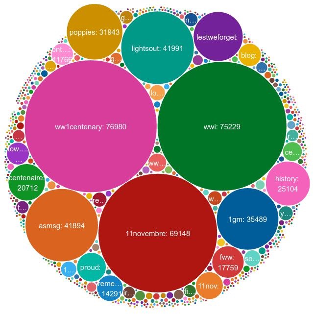
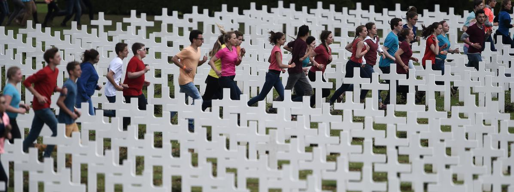
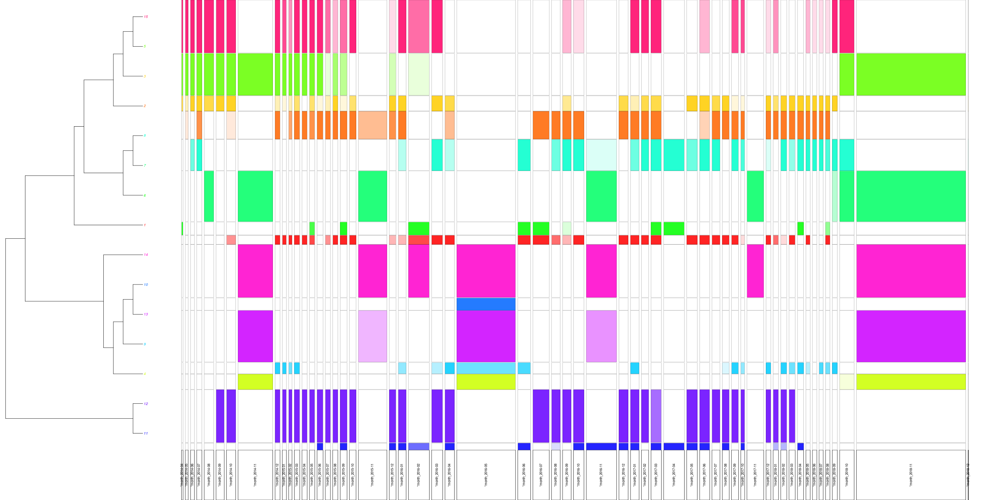

# The Centenary {data-background=img/CentenaireVerdun_t.jpg}

- exceptional series of commemorations,
- social media
  - intertwined layers of time
  - high frequency circulation of information
  - vibrations (Dominique Boullier)
- mechanisms that favors the expression of emotion
  - retweet, like, etc

## \#ww1: echoes of the Centenary of the Great War on Twitter {data-background=img/CentenaireVerdun_t.jpg}

## Commemorating Verdun {data-background=img/douaumont_t.jpg}

Two main commemorations:

- February 2016: "Saint Cyr" commemoration, ministry of Defence
- 29 May 2016 (Ossuaire de Douaumont)
  - French-German
  - two controversies

## A cold memory? {data-background=img/CentenaireVerdun_t.jpg}

<!--
# Visualizing tweets and controversies {data-background=img/darpa_trans.jpeg}

## 

## 

## 

## 

-->

# Two different controversies {data-background=img/darpa_trans.jpeg}

(in terms of circulation of information)

## The BlackM controversy {data-background=img/black-m-t.jpg}

 

 
- Web  <small>(far right website "François de souche" / fdesouche.com)</small>
- social media (Twitter)
- newspapers / TV / Radio  (off and online) (weekend)
- social media (Monday)

## The staging controversy {data-background=img/CentenaireVerdun_t.jpg}

 

- Double screen effect
- Twitter / TV interaction

# Emotion?

- Dramatisation (fdesouche.com)
- Twitter: high frequency circulation of information
- double screen effect

&rarr; emotion as a mode of connection to the past

&rarr; emotion as a way to go out of one specific political milieu
