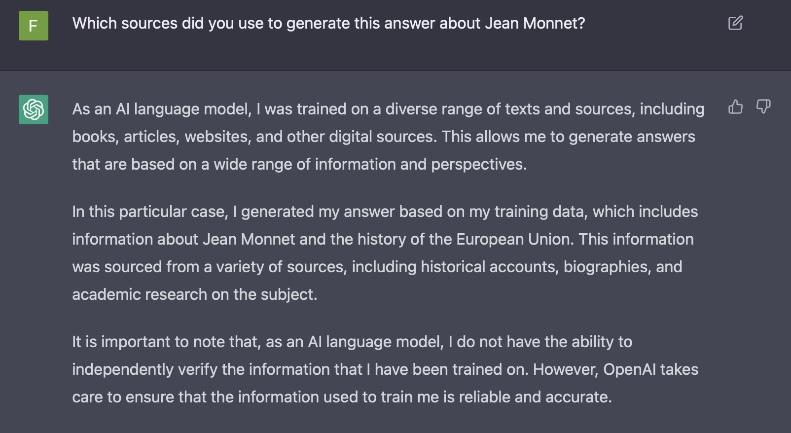

## An hypothesis

It is not about *cheating*.

It is about the fact that we may believe it is **reliable**.

Comparing ChatGPT (generated text + how it works) to historian's methods

- to emphasize the pitfalls of Large Language Models;
- to show the specificities of the historian's work.

## Five fingers?

## What is a non-5-fingers text?

## 

## Dealing with sources

