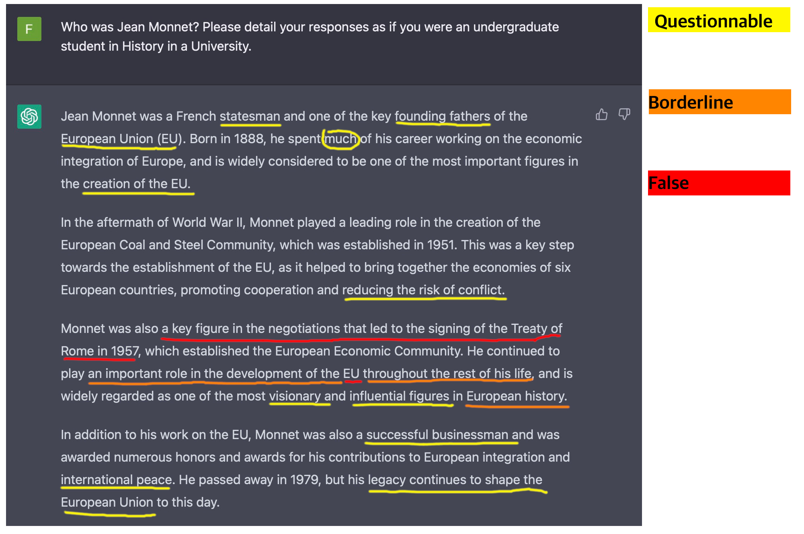

# Who am I? {data-background=img/bg/clio_bg.png}

international history

digital humanities / digital history

(digital) memory studies

# Setting the scene {data-background=img/bg/clio_bg.png}

**history in an era of networks, data and cognitive delegation**

History as a discipline and historian evolve within a precise social, political, technological context.

## History, computing and datafication:  an old challenge {data-background=img/bg/clio_bg.png}

The rise of computing, networks and data since 1945.

- 1959 (dealing with too much data): François Furet and Adeline Daumard. ‘[Méthodes de l’Histoire sociale: les Archives notariales et la Mécanographie](http://www.persee.fr/web/revues/home/prescript/article/ahess_0395-2649_1959_num_14_4_2865)’. *Annales ESC*, 14(4).

- 1961 (cross-referencing two datasets): Paul Garelli and Jean-Claude Gardin. ‘[Étude Par Ordinateurs Des Établissements Assyriens En Cappadoce](http://www.persee.fr/web/revues/home/prescript/article/ahess_0395-2649_1961_num_16_5_420758?luceneQuery=%28%28%2B%28cappadoce%29+%2B%28ordinateurs%29%29+AND+%28+%2Baccess_right%3A%28free%29+%29%29+AND+%28indexable_type%3Aarticlepag%3F%29&words=cappadoce&words=ordinateurs&words=free&words=articlepag)’. *Annales ESC*, 16(5).

## Datafication? {data-background=img/bg/darpa_bg.png}

 

- More than digitization
- The transformation of digitized (and born digital) material into data that can be computed and hence analysed
- The ideology that those data can represent better the society (or the past) than analog (traditional) interpretations

<small>Mayer-Schönberger, Viktor, and Kenneth Cukier. *Big Data: A Revolution That Will Transform How We Live, Work, and Think*. Houghton Mifflin Harcourt, 2013.</small>

## At the root of datafication:  (personal) computer and networks  {data-background=img/bg/darpa_bg.png}

 

- 1980s: rise of personal computing
- 1990s: internet / web
- 2000s: social media / platformization of the web (*i.e.* big data)
- 2010s: AI (Machine/deep learning)

## History and cognitive delegation  {data-background=img/bg/darpa_bg.png}

 

- Some historians seized those evolutions from the very beginning
- Emergence of *Digital Humanities* and *Digital History* since the mid-2000s
- Many projects that uses AI

Ex:

- [Trésor des Chartes](http://himanis.huma-num.fr/app//)
- [Transkribus](https://readcoop.eu/transkribus/)

## The difficult question of the historian's computing skills (French case)  {data-background=img/bg/darpa_bg.png}

- End of the 1970s: French Medievists rise the question of teaching computing in History
- 1986: Jean-Philippe Genet: Genet, Jean-Philippe. ‘[Histoire, Informatique, Mesure](https://doi.org/10.3406/hism.1986.904)’. Histoire & Mesure, 1(1), 1986.
- 1993: Genet, Jean-Philippe. ‘La Formation Informatique Des Historiens En France: Une Urgence’. Mémoire Vive, no. 9.
- 2011: Ruiz, Émilien, and Franziska Heimburger. ‘Faire de l’histoire à l’ère Numérique : Retours d’expériences’. Revue d’histoire Moderne et Contemporaine, n° 58-4bis.
- 2019: dhiparis. ‘[Enseigner le numérique aux historien·ne·s – perspectives internationales #dhiha8](https://dhiha.hypotheses.org/2619)’. Digital Humanities à l’Institut historique allemand.

##  {data-background=img/bg/darpa_bg.png}

 

for non-French examples:

- Salmi, Hannu. *What Is Digital History?* Polity, 2020.

# The rise of Digital History?  {data-background=img/bg/friedrich_bg.png}

</img>

Historian looking at a see of data.

## The datafication of History {data-background=img/bg/friedrich_bg.png}

 

### Mass digitization of primary (and secondary) sources + cheap computing + network 

- Transition from primary sources to dataset
- The emergence of the big data of the past

 

### Platformization of the web

- The emergence of new primary sources (ex: social media)

## New challenges: Preservation {data-background=img/bg/friedrich_bg.png}

 

- Rosenzweig, Roy. ‘[Scarcity or Abundance? Preserving the Past in a Digital Era](https://doi.org/10.1086/529596)’. The American Historical Review, 108(3), June 2003.)

## New challenges: the [Democratization of history?](http://archive.boston.com/bostonglobe/ideas/articles/2008/05/25/everyones_a_historian_now/) {data-background=img/bg/friedrich_bg.png}

 

- Democratization through accessibility
- No democratization of methodology

## New challenges: reading {data-background=img/bg/friedrich_bg.png}

<small>Moretti, Franco. Graphs, Maps, Trees: Abstract Models for Literary History. Verso, 2007.</small>

Towards scalable reading.

<small>Clavert, Frédéric, and Andreas Fickers. ‘[On Pyramids, Prisms, and Scalable Reading](https://journalofdigitalhistory.org/en/article/jXupS3QAeNgb)’. Journal of Digital History, no. jdh001, 2021.</small>

# Revisiting old primary sources  through digitization {data-background=img/bg/friedrich_bg.png}

**The case of digitized Newspapers**

- Newspapers as the most digitized kind of primary sources
- Renewal of media history
- Numerous projects based on digitised newspapers (= form of datafication)
  - Oceanic Exchanges, Numapress, Impresso, NewsEye...
  
## The Impresso Project {data-background=img/bg/impresso_bg.png}

Swiss project (EPFL, Université de Lausanne, University of Zürich) with Luxemburgish partnership (C<small>2</small>DH)

<small>Bunout, Estelle, et al., eds. *Digitised Newspapers – A New Eldorado for Historians? Tools, Methodology, Epistemology, and the Changing Practices of Writing History in the Context of Historical Newspapers Mass Digitization*. De Gruyter Oldenbourg, 2022.</small>

## Taking into account the datafication phenomenon  {data-background=img/bg/impresso_bg.png}

</img>

## Big data of the Past and the flaws of Big data {data-background=img/bg/friedrich_bg.png}

 

Big Data (of the past) is a social construct as all data.

 

<small>Boyd, Danah, and Kate Crawford. ‘[CRITICAL QUESTIONS FOR BIG DATA: Provocations for a Cultural, Technological, and Scholarly Phenomenon](https://doi.org/10.1080/1369118X.2012.678878)’. Information, Communication & Society, 15(5), 2012.</small>

## Big data of the past and the lamp post effect {data-background=img/bg/friedrich_bg.png}

 

<small>- Claire Lemercier and Claire Zalc, *Quantitative Methods in the Humanities. An Introduction*, London: University of Virginia Press, 2019.</small>

<small>- Milligan, Ian. ‘[Illusionary Order: Online Databases, Optical Character Recognition, and Canadian History, 1997-2010](https://doi.org/10.3138/chr.694)’. *Canadian Historical Review*, 94(4), 2013.</small>

<small>- Putnam, Lara. ‘[The Transnational and the Text-Searchable: Digitized Sources and the Shadows They Cast](https://doi.org/10.1093/ahr/121.2.377)’. *The American Historical Review*, 121(2), 2016.</small>

## Big data of the past and AI {data-background=img/bg/friedrich_bg.png}

- AI today is mostly linked to machine learning / deep learning
- learning => training
- training => big data
- if training datasets are biased, so is any AI-based system

# Exploring new sources:  the example of social media {data-background=img/bg/ww1_bg.png}

 

- New Sources for future historians
- Today's sources for historians (sociologists, linguists...) interested in the link between history and collective (cultural) memory

## #ww1: echoes of the Centenary  of the Great War on Twitter {data-background=img/bg/ww1_bg.png}

 

## 

</img>

## 

</img>

##

</img>

## 

</img>

## Fragility {data-background=img/bg/ww1_bg.png}

 

# Discreet digital practices {data-background=img/bg/clio_bg.png}

 

<small>Muller, Caroline, and Frédéric Clavert. ‘[De la poussière à la lumière bleue](https://doi.org/10.4000/signata.3136)’. *Signata. Annales des sémiotiques / Annals of Semiotics*, no. 12, 2021.</small>

# How to teach history  in the digital world? {data-background=img/bg/clio_bg.png}

**some non definitive remarks**

## The diversity of the echoes of the past {data-background=img/bg/clio_bg.png}

 

Most citizens' encounters with the (historical) past happen in a non-academic / non-secondary-education context.

- The most striking example is video games

## The myth of digital natives {data-background=img/bg/clio_bg.png}

- There's no digital natives
- Facebook (or Snapchat, or Instagram, or Whatsapp, etc -- depending on places and time) natives

**We should not assume that our students are better fitted to the datafied world we are living in.**

## basics are still valid... {data-background=img/bg/clio_bg.png}

- The importance of primary sources and their critical appraisal
- The importance of methodology
- The importance of reading

...but are to be updated

<small>Haber, Peter. ‘[Digital Past: Geschichtswissenschaft im digitalen Zeitalter](https://doi.org/10.1515/9783486712339)’. Digital Past, Oldenbourg Wissenschaftsverlag, 2011</small>.

# Conclusion {data-background=img/bg/clio_bg.png}

 

**we should be timelords**

but we are not.

##

 </img>

## 

 </img>

## Thank you! {data-background=img/bg/clio_bg.png}

[Prez available online: https://inactinique.github.io/](https://inactinique.github.io/)

