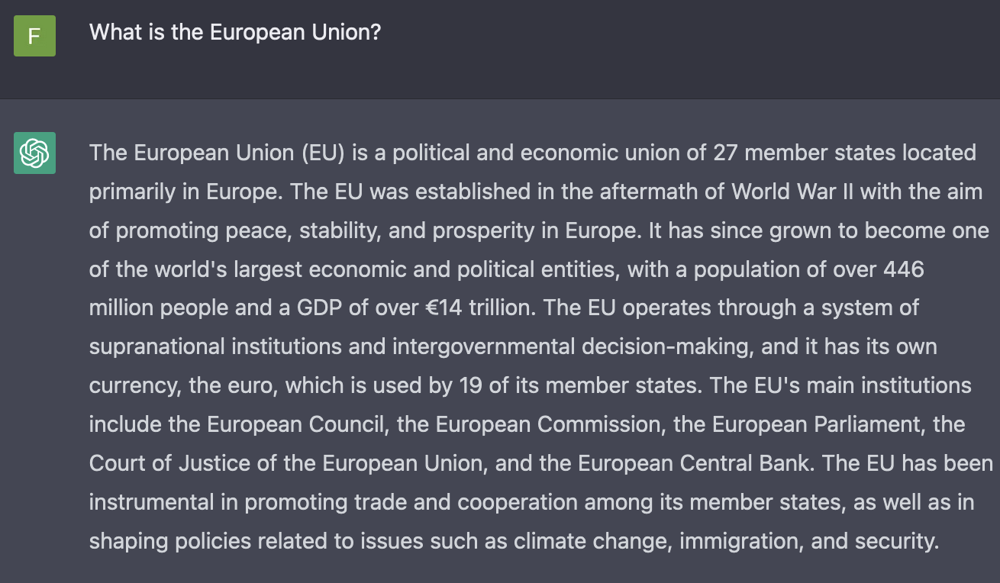
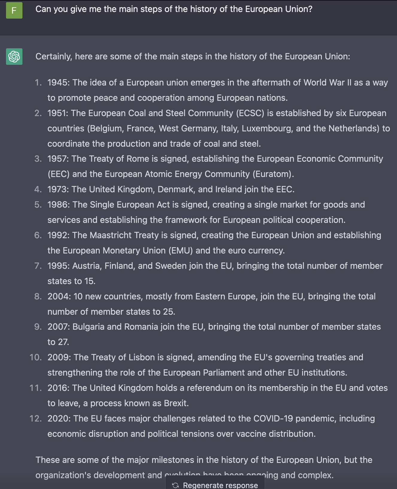
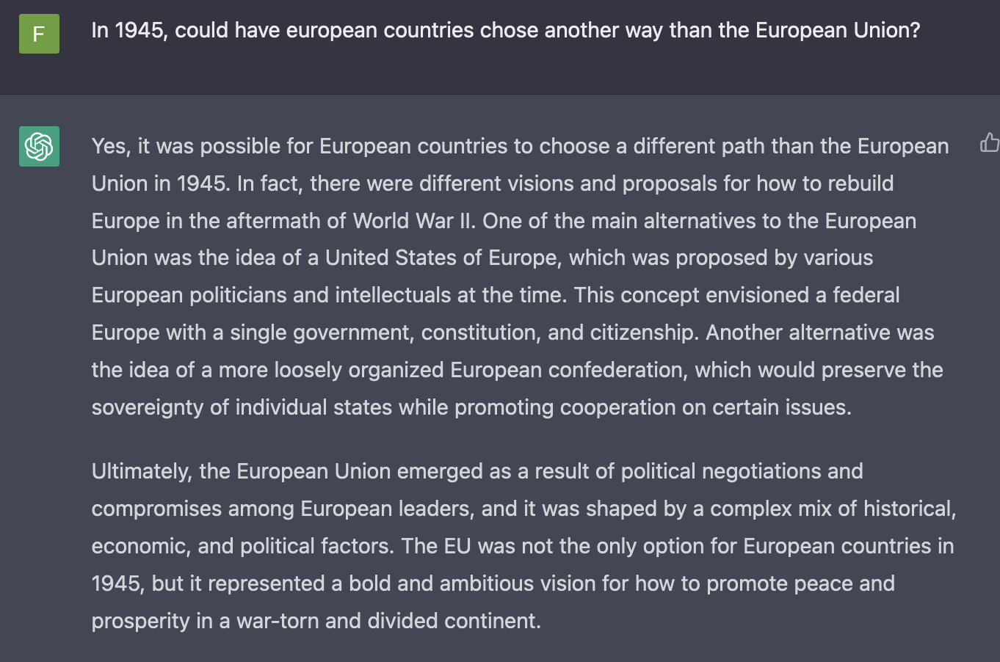
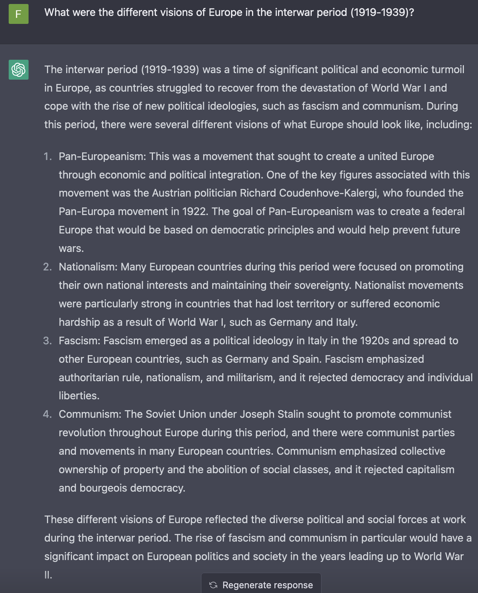
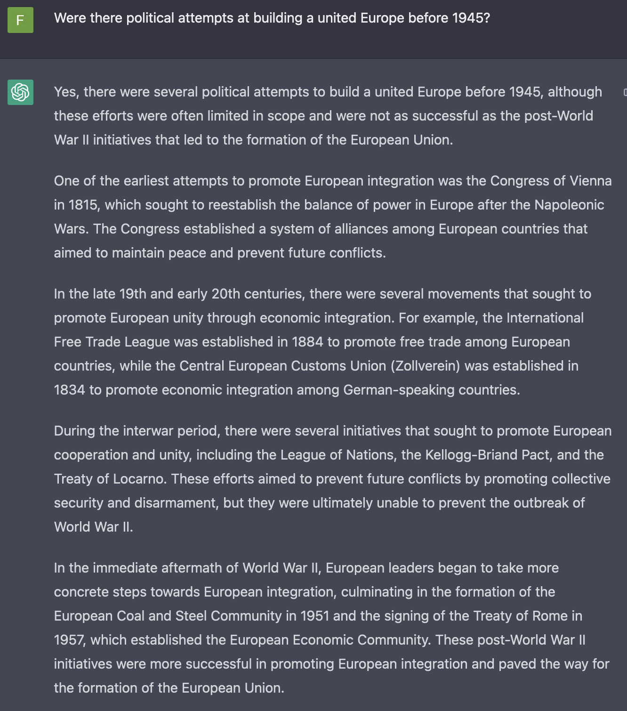
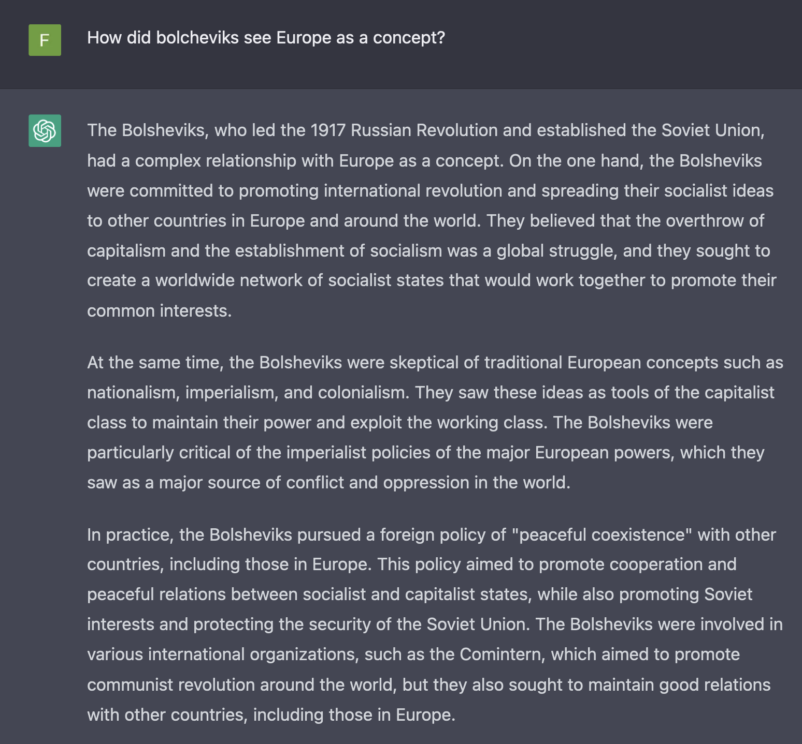
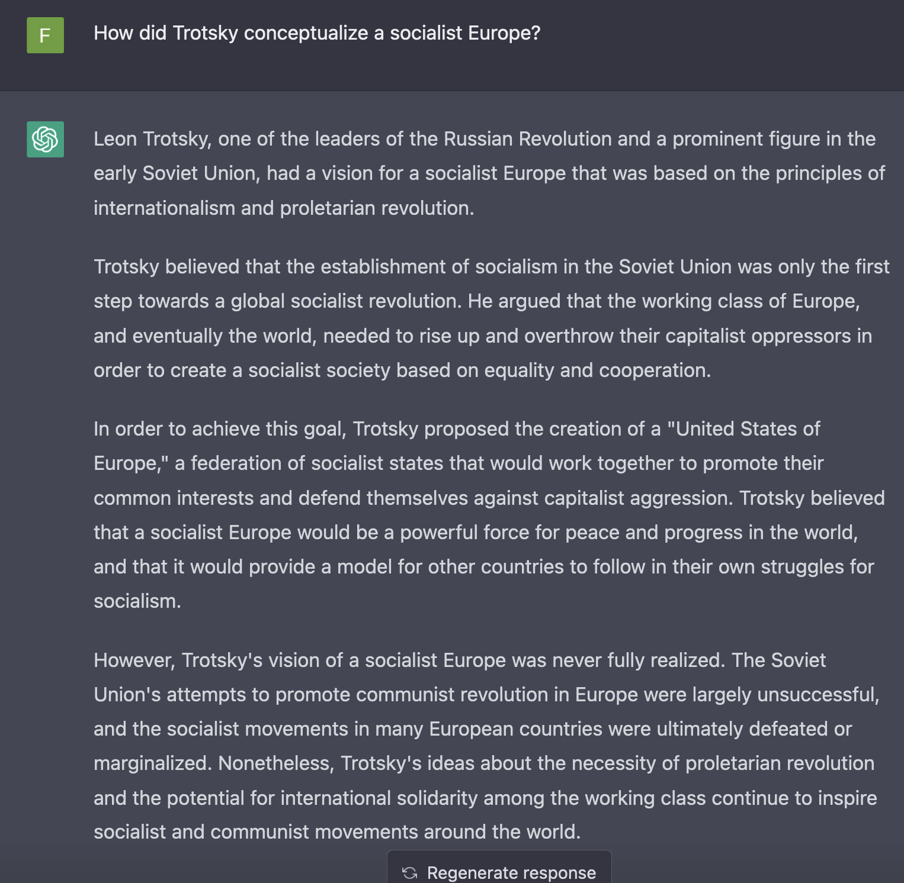
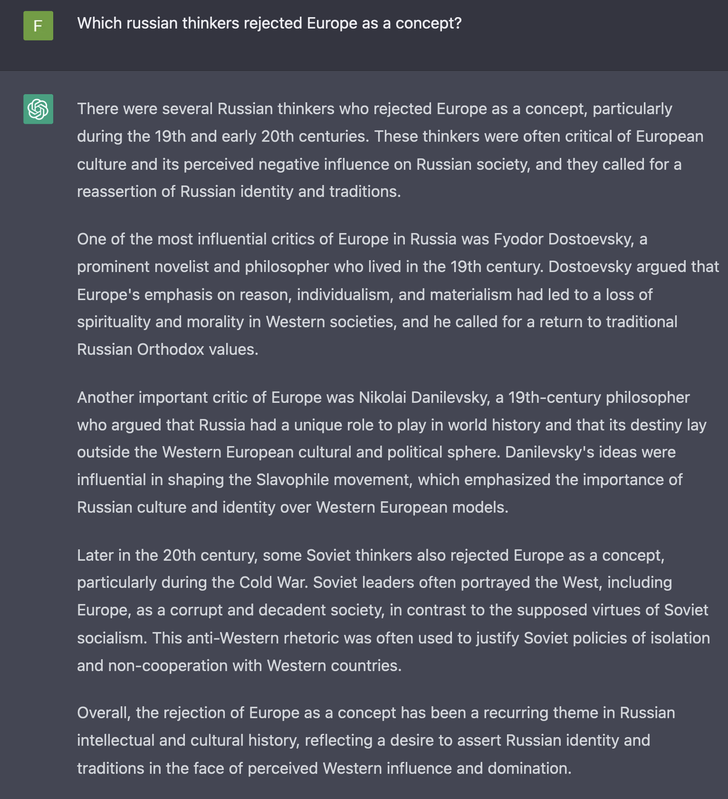
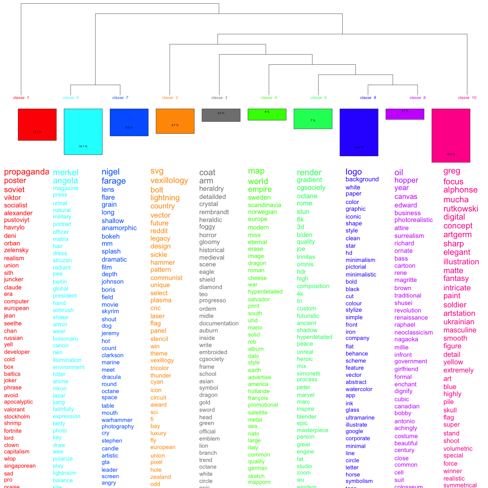
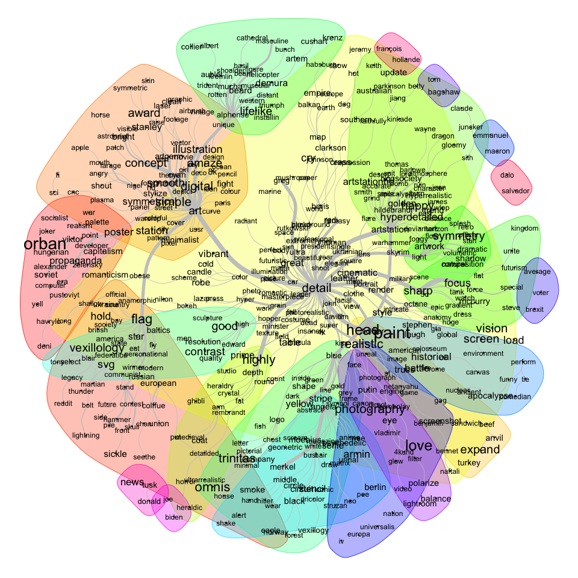

# The example of ChatGPT

## What are LLMs?

- a neural network architecture (ie deep learning / AI)
- trained on a large corpus of text
- LLMs will produce statistically pertinent chains of words

Are getting biger and biger since a new architecture proposed by Google in 2017 (Transformers)

## What is ChatGPT

ChatGPT is a LLM (GPT-3 or 4) from OpenAI that is optimized for conversations (a very performant chatbot).

ChatGPT has strong limitations:

- we do not know precisely its training corpus &rarr; biases!
- it is a machine: not a clue about reasoning, ethics, etc.
- it gives the impression -- as it can « discuss » that it has reasoning, ethics, etc.

## Why testing ChatGPT on European history?

- deep learning requires a training corpus
- the training corpus embeds representations of the world
- people interacting with ChatGPT will interact with those embedded representations of the world.
- we and our students will, hence, too.

Beyond history, LLMs and AI might become the main mode of 'mediated' memory.

# ChatGPT and the European Union

## 

## 

## 

## 

## 

## 

## 

## 

# What about the prompts?

ChatGPT prompts are not available.

For LLM that generated images, one model is open source (Stable Diffusion).

[Lexica.art](https://lexica.art/?q=European+union) is an AI generated image search engine, with prompts. 

## topic modelling

## Similitude analysis

