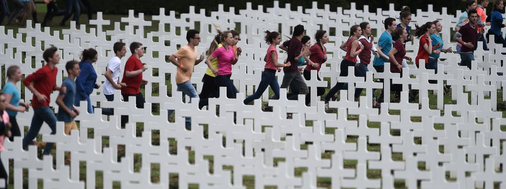
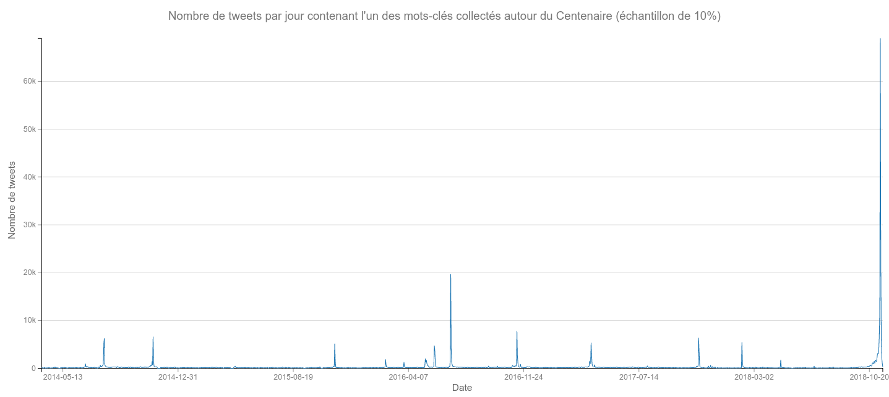

# {data-background=../img/background01.jpg}

histoire des relations internationales / histoire numérique / *memory studies* 

#ww1 / #covid19fr / awac2

<aside class="notes">
À partir de l'exemple du Centenaire de la Grande Guerre mais aussi de celui de la crise sanitaire et de ses commémorations confinées au printemps 2020, cette intervention propose d'évaluer les usages possibles des outils numériques pour l'étude des mémoires collectives à l'ère numérique. Comment (ne plus) constituer un corpus de tweets ? Quelles méthodes choisir ? Quels types d’analyse effectuer ?
</aside>

# Introduction: #Verdun100 {data-background=../img/CentenaireVerdun_bg.png}

<aside class="notes">
En mai 2016, un site web français d’extrême-droite conteste l’organisation d’un concert du rappeur BlackM dans le cadre de la commémoration du Centenaire de la bataille de Verdun. L'extrême droite estimait que BlackM était trop critique de la France. Le jour même de la commémoration, sa mise en scène a choqué -- non les personnes sur place à l'ossuaire de Douaumont, mais celles qui sur Twitter commente ce qu'ils voient à la télévsiion (ou se contentent de retweeter). Cette mise en scène impliquait que de jeunes français et allemands -- celles et ceux pous qui le concert de BlackM, en remerciement, aurait dû être organisé -- courent au travers des tombes du cimetière militaire devant l'ossuaire. Vêtus d'habits vifs, ils devaient symboliser ce qu'ont perdu France et Allemagne à Verdun: une grande partie de leur jeunesse. Cette mise en scène a été vue par beaucoup comme une forme de profanation. Une double controverse, donc: un concert de rap et une mise en scène. 

Mais ces deux controverses ont largement été amplifiées par le système médiatique tel qu'on le connaît aujourd'hui, où réseaux sociaux numériques peuent 'donner le ton' mais en interaction avec la presse, papier ou en ligne si cette distinction a encore du sens, la radio ou évidemment la télévision. Il y a cependant, dans cette interaction, une spécificité des réseaux sociaux numériques et, particulièrement dans notre cas, Twitter: la circulation de l'information à haute fréquence.
</aside>

## Mémoire et commémoration à haute fréquence {data-background=../img/CentenaireVerdun_bg.png}

 

- Twitter comme espace de circulation de l'information à haute fréquence (retweet, mention, quote, etc)
- Soubresauts de cette haute fréquence: 'vibrations';

 

&rarr; mémoire collective comme interaction (résultant de liens sociaux) entre stock et circulation d'informations : la haute fréquence ne peut qu'avoir des conséquences sur la mémoire collective et sur les modes de commémoration.

<small>
@halbwachsCadresSociauxMemoire1994 / @boullierBigDataChallenges2016 (EN) / @boullierSciencesSocialesFace2015 (FR).
</small>

<aside class="notes">

Dans ses travaux comme dans l'entretien qu'il avait donné au *Temps des Médias*, Domminique Boullier décrit les réseaux sociaux numériques comme des espaces de circulation de l'information à haute fréquence (il parle de rhyzome, suivant en cela des trvaux de Gabriel Tarde). Le terme 'haute fréquence' marque ici un parallèle implicite avec la finance à haute fréquence, c'est-à-dire des transactions automatisées au niveau de la milli si ce n'est de la microseconde. Dans le cas de Twitter et plus généralement des réseaux sociaux numériques, c'est la question de la propagation -- parfois mémétique -- de l'information qui est à haute fréquence. L'information se diffuse nettement plus vite. Cela a des avantages en termes de recherche: on peut se situer, avec Twitter par exemple, au niveau de la seconde comme, avec certains types d'analyse, l'on peut aussi se situer sur des échelles temporelles plus globales. 

Cette cirulation de l'information a haute fréquence a -- d'une certaine manière comme la finance à haute fréquence et ses krachs instantanés -- des soubresauts, que Dominique Boullier a appelé -- je crois que c'est le terme anglais d'ailleurs -- des vibrations. Des moments courts, très brefs, très intenses, de circulation de l'information. 

Les deux controverses de Verdun sont de telles vibrations, sur un modèle différent (le web => Twitter => les médias plus traditionnels en ligne => retour à Twitter pur la première ; interaction TV / Twitter pour la seconde, puis reprise dans des médias plus traditionnels). La circulation de l'information à haute fréquence a ici eu une claire conséquence, deux controverses, donc.

</aside>

## Comment étudier la mémoire collective   « à haute fréquence »? {data-background=../img/CentenaireVerdun_bg.png}

- proposition méthodologique au croisement de plusieurs éléments:
  - les propagations,
  - *big data* (données massives + induction),
  - *scalable reading*

- et de quelques garde-fous:
  - le lien avec la source primaire
  - le lien « avec le réel » c'est-à-dire ne pas perdre de vue les liens « in real life » / « on line » (*onlife*)

<small>
@boullierPropagationsNouveauParadigme2023 / @clavertPyramidsPrismsScalable2021 / @floridiFourthRevolutionHow2014
</small>

<aside class="notes">

Cette longue introduction me sert surtout à poser la question méthodologique, aujourd'hui. Je vais exposer mes méthodes et insister sur plusieurs points:

- Le départ de ma démarche est clairement liée à ce que l'on a appelé, il y a 5 ou 6 vagues de hype, le *big data*. Big data, du moins, du point de vue de l'historien:
  - données massives,
  - mais aussi une démarche plus inductive qu'habituellement -- la démarche de l'historien.ne est souvent inductive, mais ici ce trait est amplifié. 
  - Cette tendance à l'induction est assez fortement liée à la manière dont j'ai mené ce projet de recherche sur les échos du Centenaire de la Grande Guerre.
- Qui dit données massives dit lecture distante (@morettiDistantReading2013) et ses limites d'ailleurs
- Mais l'une des conclusions de mes deux projets de recherche (#ww1 et #covid19fr) c'est que l'on ne peut se passer d'une part d'une lecture proche -- toute dimension numérique doit permettre de garder contact avec nos sources primaires -- d'une part, mais également du lien entre mémoire collective telle qu'elle s'exprime sur les réseaux sociaux numériques et mémoire collective en dehors du numérique.

</aside>

# De #ww1 à #covid19fr {data-background=../img/background03.jpg}

<aside class="notes">

Je vais ici employer deux exemples: 
- les échos du Centenaire de la Grande Guerre sur Twitter
- commémorer la fin de la Seconde Guerre mondiale en période de confinement

La seconde recherche a été menée avec notre collègue Deborah Paci.

</aside>

## Un usage classique des méthodologies numériques {data-background=../img/friedrich_bg.png}

<aside class="notes">

Je ne revendique pas un usage complexe des méthodologies des humanités numériques -- je peux en faire un usage complexe, mais ce n'est pas toujours nécessaires. Dans les deux cas évoqués ici, le label *histoire numérique* ou *humanités numériques* s'impose notamment pas un simple fait: l'usage de sources dites nativement numériques et qui font sens individuellement mais surtout lorsqu'elles sont conservées en masse.

Mon problème ici est plutôt -- et j'y reviendrai -- d'adapter au mieux les méthodes les plus appropriées à mes recherche, c'est-à-dire de bricoler. Je suis dans la position de cet historien (ou historienne) face à une mer de données.

</aside>

## Collecter 9 millions de tweets {data-background=../img/friedrich_bg.png}

#ww1:

- 9 millions de tweets (2014-2019)
  - deux tiers de retweets
  - 1.5 million de comptes Twitter
- collecte: Twittter API v1.1
  - streaming
  - mots-clés / hashtags
- modification des hashtags au fur et à mesure de la collecte
  - émergence de hastags (été 2014 : #1j1p)
  - hashtags non prévisibles à lavance (#somme100)

<aside class="notes">

Pour analyser, il faut collecter. Vous voyez ici la description de la base de données finale du projet #ww1. 

</aside>

## Surveiller et anticiper {data-background=../img/friedrich_bg.png}

- Surveiller sa base de données
  - Apparition de hashtags
  - Absence de hashtags: Marne, Jaurès, Clémenceau...
- Surveiller son terrain

&rarr; anticiper

<aside class="notes">

Mener une recherche de ce type, pour collecter des données pas trop biaisées, nécessite de surveiller et d'anticiper. Surveiller sa base de données (c'est-à-dire l'analyser régulièrement avec des outiles de lecture distante notamment, mais aussi de la lecture proche) permet de voir des hashtags émerger; J'ai cité #1j1p car c'est comme ça qu'il m'est apparu évident qu'il fallait l'inclure dans la collecte: il était très présent dans mas base de données alors qu'il n'était pas collecté. Mais cela permet aussi de constater des absences: sans hashtags clairement identifié pour la première bataille de la Marne -- la fin de la progresison allemande et le début du passage d'une guerre de mouvement à une guerre de position --, cette dernière n'apparaît quasiment pas. Les hashtags liés à Jean Jaurès -- assassiné le 31 juillet, assassinat qui permet le ralliement de la gauche française à l'Union sacrée -- n'a pas pu être inclus dans la base de données, car il portait sur l'ensemble des commémorations organisées pour le centenaire Jaurès. Il en est allé de même avec Georges Clémenceau (2017 a été l'année Clémenceau).

Mais il y a Vimy. 

Il s'agit aussi de surveiller son terrain, ici Twitter. Être sur Twitter les grands jours de commémoration -- le 1er juillet 2016, par exemple, pour le Centenaire de la Somme -- permet d'inclure des hashtags que l'on n'aurait pu prévoir au début du projet: parce que l'on voit le hashtag apparaître, mais aussi parce que, parfois, des comptes Twitter -- j'ai parlé de mes recherches sur twitter -- m'ont signalé des hashtags à inclure, parfois parce qu'ils étaient **physiquement** présent sur le lieu de commémoration.

C'est cette surveillance de la base de données, du terrain, qui permet d'anticiper, ce qui était nécessaire avec les commandes de l'API de Twitter que j'utilisais (API V1.1 streaming).

</aside>

## Quelques analyses {data-background=../img/figure01_bg.png}

##

<aside class="notes">

Surveiller sa base de données peut se faire de manière diverse. Ici, on peut voir les hashtags les plus présents. Ce sont pour l'essentiel les hashtags collectés, mais pas uniquement. On pourra y apercevoir #blackm par exemple. 
</aside>

##

<aside class="notes">

Les statistiques trop simples sont parfois problématiques, mais ici elles restent efficaces: on peut voir le rythme comméoratif du Centenaire tel qu'il s'est inscrit dans ma base de données. Avec des régularités, particulièrement le 11 novembre.

</aside>

##

<aside class="notes">

Ces régularités s'observent aussi sur la répartition linguistiques. Les exemples que je vais donner son francophones, mais 80% de mon corpus est anglophone. Les seules dates où les tweets francophones sont majoritaires sont soit le 11 novembre (sauf 2018), soit reliés à des commémorations spécifiquement françaises (Verdun).

Toutefois, cette répartition linguistique peut être questionnée: reflète-t-elle les choix que j'ai fait ou les échos des commémorations du Centenaire sur Twitter? Probablement les deux.

</aside>

##

<aside class="notes">

Bien sûr, nous utilisons l'inévitable *topic modelling*. En fait, quelque chose de similaire au topic modelling, appelé *classification hiérarchique descendante*, issue de la théorie des mondes lexicaux (@reinertMethodeClassificationDescendante1983 et @reinertMondesLexicauxLeur1993). La fonction est la même, bien que le raisonnement statistique ne soit pas le même (mais globalement fondé sur sur les cooccurrences de mots).

On peut déduire beaucoup de choses de ce graphique. La présence de la figure du poilu mort pour la France, des éléments commémoratifs descriptifs, mais aussi politiques. On y voit la controverse BlackM / Verdun, mais aussi une classe (profil, ou cluster) plus généralement lié à la contestation.

</aside>

##

<aside class="notes">

Et l'on peut projeter ces classes dans le temps. Parmi les choses que l'on peut ici déduire:

- la manière dont le Poilu est évoqué en fonction du programme de la commémoration;
- mais également le fait que presque toute commémoration apporte sa contestation, ce qui va contre l'idée, professée par certains (Pierre Nora) que la commémoration rassemble.

Cela nous renvoit aussi à la question des temporalités. J'ai insisté sur la propagation au début de mon exposé. Ici, on en voit les effets mais également ses limites: il y a aussi -- et c'est le cas de la contestation de la commémoration qui se fait plutôt à bas bruit -- des temporalités de plus long terme.

Au-delà, ainsi, de la propagation, il y a surtout la question de l'entrelacs des temporalités.  

</aside>

## 

<aside class="notes">

Enfin, le grand classique de l'analyse réseau. Il est intéressant d'en faire une dynamique, d'autant plus que la période de collecte est large. Car ici, l'on voit trois groupes: le grand groupe anglophone, le groupe francophone. Et ce dernier est divisé en deux: le sous groupe que vous voyz ici le plus à gauche s'est constitué progressivement. C'est un groupe contestataire.

</aside>

## Quels types d'analyse effectuer?  {data-background=../img/figure01_bg.png}

- iramuteq / gephi
- topic modelling / analyse réseaux
- avoir un oeil sur les méthodes émergentes (qui deviennent bien rôdées)
  - word embeddings

# bricolage, braconnage {data-background=../img/bg_Sillons.png}

## bricolage? Le cas du projet #covid19fr {data-background=../img/bg_Sillons.png}

- 15 mars 2020: reprise du serveur #ww1 pour collecter des données sur la crise sanitaire en cours 
- Base de données de 65 millions de tweets (la moitié sur mars-juin 2020)
  - collecte stoppée depuis le 15 mars 2023 (Elon Musk, fin de l'APIv1.1)
- Objectif: collecte de très long terme
  - quels aspects de la crise deviendront mémoire collective?

&rarr; réutilisation d'un savoir-faire antérieur.

<aside class="notes">
Pour illustrer cette notion de bricolage, je vais cette fois me pencher sur le projet « #covid19fr -- un pays confiné sur Twitter »
</aside>

## bricolage: la fluidité des outils numériques {data-background=../img/bg_Sillons.png}

- la base de données n'a pas (ou peu) servi
- sortie de l'APIv2 et de l'*academic product track*

&rarr; Utilisation de twarc,  collecte de corpus ad hoc (fonction de l'article et de sa question de recherche)

## Commémorer en confinement: 8 mai et 25 aprile {data-background=../img/bg_Sillons.png}

- corpus italophone (25 aprile) et francophone (8 mai) sur les commemorations de la fin de la Seconde Guerre mondiale
- bases techniques de collecte très différentes
  - donc des biais différents: lissage des controverses
- lien IRL / online très fort
  - la comparaison entre les deux corpus montre deux manières de commémorer très différentes
  - traditions différentes
  - traditions différemment adaptées au confinement

<small>
@clavertGoutJourFetetobepublished
</small>

##  {data-background=../img/bg_Sillons.png}

bricolage + fluidité des dispositifs socio-techniques

&darr;

deux manières de collecter des tweets / deux recherches différentes

## du bricolage au braconnage {data-background=../img/bg_Sillons.png}

- Bricolage &rarr; s'adapter pour survivre
- Braconnage &rarr; contourner pour s'adapter pour survivre

Que faire quand l'accès aux données est coupé, quand un outil que l'on maîtrise n'est plus développé,  quand une institution bloque l'aspect à des données, des outils, des coopérations?   Comment équilibrer les impératifs (légitimes) de la protection des données et ceux de la recherche?

## braconnage {data-background=../img/bg_Sillons.png}

Le braconnage est une configuration où la recherche est un étroit chemin de crête entre deux océans d'illégalité (et d'illégitimité):

- éthique et données personnelles;
- respect des conditions d'accès aux données.

# Conclusion {data-background=#ededed}

- proposition méthodologique hybride / adaptée au corpus, à la recherche menée
  - hybride car pluridisciplinaire
  - hybride car *scalable reading* -- impliquant de garder un lien aux sources primaires
- proposition qui s'accompagne de la notion de bricolage: s'adapter à l'évolution des outils que nous utilisons
  - peut aller jusqu'au braconnage

## bricolage, braconnage, sabotage? {data-background=#ededed}

Quand est-ce que bricoler, braconner ne devient plus possible?  Quand est-ce qu'il faut saboter ses propres recherches?

## Bibliographie {data-background=#ededed}

<small>
