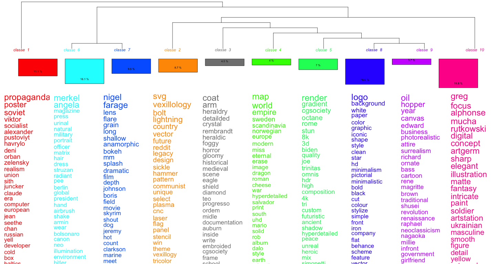
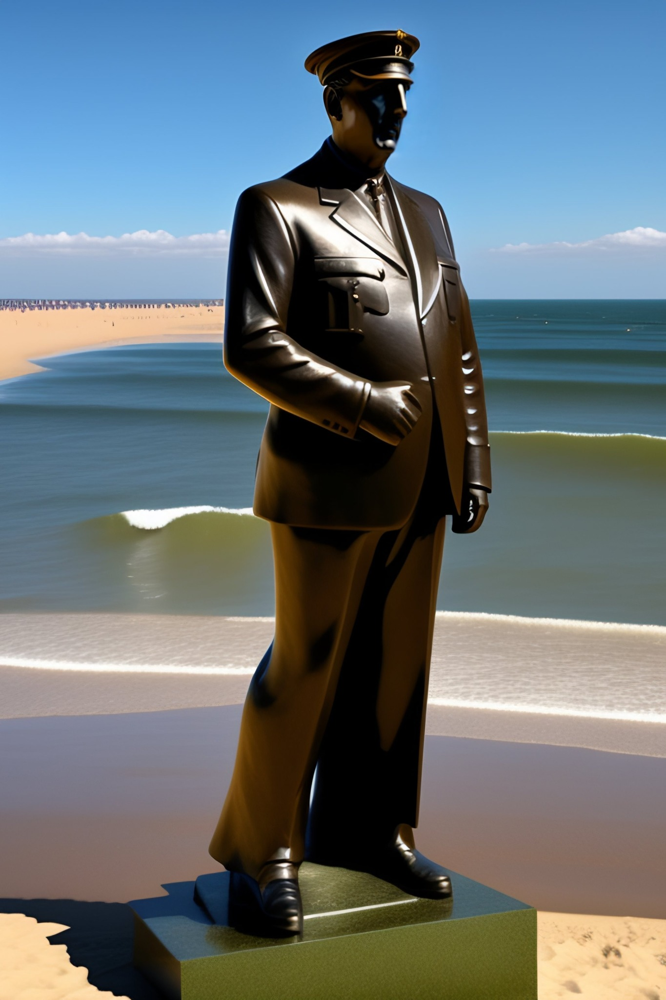

# 

digital memory studies

<aside class="notes">

Just a few words about me:
- I'm coming from international history but turned to digital humanities (depending on the definition you have of DH) and digital history;
- then started to study online commemoration and hence turned to digital memory studies.

Here, i'm trying to wonder what we can do with new artefacts of the big data / AI era. It's a starting project, even only an idea yet.

To be honest, I'm not even sure it's DH.

</aside>

# 

> [a french legionary, walking in a field, with black smoke of a fire in background](https://lexica.art/prompt/df06475d-3862-4fac-936e-86657566f524)

<aside class="notes">

You probably all have seen that kind of images, generated by AI systems, here available on a search engine called [lexica.art](https://lexica.art).

There's many thing to say here:
- the helmet looks absolutely wrong, and really not French -- the spiked helmet evokes more something German, the form is somewhere between the Wermacht and Darth Vader.
- it doesn't look at all like a French legionary
- I found it with 'Napoléon' as a keyword, and there's something about that, though we are far from the Grognard.

Historically it's just nonsense.

</aside>

## 

> [Chartist revolutionaries storming Westminster](https://lexica.art/prompt/c6d9d058-adf2-4a39-8652-6c5d2d0bf2a5)

<aside class="notes">

Well british history's not my specialty, but here again, there are some elements to say -- in fact, the impression of an infinite repetition of only one man is a strange way to represent a working class movement.

</aside>

## 

> [Nalanda University in 1300 AD](Nalanda University in 1300 AD)

<aside class="notes">

Here again, the image is puzzling. This one of a series of four, and this series mix different civilisations, including Mayas, China, Japan. But barely India.

</aside>

# 

questionning the past

<aside class="notes">

If those images are that terrible, why having an interest in them?

- Questionning the past is one of the core activity of historians / and other humanists / social scientists working on the past;
- It's our basic epistemologic operation in the sense that we ask questions to start the process of elaborating new knowledge about the past.

The fact that tools (image or text generative systems), easy to use, are based on prompts -- which are often explicit or implicit questions.

Those systems are huge incentives to question the world around us, and the world that was. That should not let us indifferent.

At least does it not leave me indifferent, all the more that some of those prompts contain references to the past.

It's all the more interesting that those system could be defined as a-epistemological: when you use ChatGPT, for instance, there's no notion of truth, lie, knowledge in the way those systems are working.

</aside>

# 

prompts as open doors to users' imagination about the past?

<aside class="notes">

So, as an historian, what interest me the most in LLMs or similar system, whether they generate images or texts, are not those systems, are not what they produce, but what is necessary to produce them: prompts -- of course when they evoke the post. The text that we need to enter to get images or texts -- images can also be entered, but let's stick for now to text --, that's a new kind of primary sources potentially linked to the past. 

- prompts can be seen as open doors to users' imagination about the past -- of course, it's much more complex than that, but nevertheless, we'll use this as a sort of hypothesis;
- So LLM or text-to-image system, if we follow this hypothesis, can be seen as not only text-to-image or text-to-text but also as system that, as an aside, are generating primary sources on collective memory.

</aside>

## 

distant reading of prompts

<aside class="notes">

Of course there are some things that we can already do. There are some prompts search engine already existing. A colleague of mine developped a small scrapping script and we could harvest some prompts.
I've used my usual tools [IRaMuTeQ](https://iramuteq.org).

</aside>

## 

<aside class="notes">

- that's a basic distant reading of a corpus of prompts
- the keyword 'europen union' was used to get this corpus of around 1900 prompts
  - it's not only about the past, but quite a lot about
  - there are clusters about styles -- note that a lot are 'historical' (soviet propaganda)
  - there are elements of recent politics (nigel farage / marine) 
  - europe as something linked to a period of time: Middel Age (heraldic) / 17th Century (Rembrandt)
  - notions quite linked to european history: 'empire'
  - the question of the link with news is quite important.

</aside>

## 

limitations / corpus

<aside class="notes">
- no timestamp / temporal data
- strong reflexion to have about the making of the corpus of prompts.
  - several search engine
  - few metadata (which is good for privacy, but not for us)

There's a huge work to get data, and it might be impossible to get them in good conditions -- good being here ethics and privacy minimal requirements.

</aside>

# 

who's prompting, users or machines?

<aside class="notes">

the data is not the only thing important here. With prompts only, we do not have the whole picture, we're missing what's happening between the users and the interface.

</aside>

## 

> [joe biden doing a nazi salute, in front of brandenburger tor. huge nazi crowd in front of him. face of joe biden is clearly visible. canon eos r 3, f / 1. 4, iso 1 6 0 0, 1 / 8 0 s, 8 k, raw, grainy ](https://lexica.art/?q=history&prompt=486249a4-4f50-46c8-9163-d7430c2b46db)

<aside class="notes">

- the aim here of the user was to get a nazi salute -- and it's not working
- It's not working for different reasons:
  - well, this system does not know what a nazi salute is -- images here are just pixels which succession is statistically pertinent
  - there might be limitations implemented in the text-to-image system (not likely with stable diffusion)

What ill do a user who did not get the results it wanted? 

- as it fails, users might have strategies to get what they want
  - strategy based on changing prompts, 
  - means that prompts, not only images (or generated text), are the result of the settings of the machine, or at least partly, and of a man-machine interaction.

</aside>

## how to study prompts?

<aside class="notes">

- we need prompts with proper metadata and that relate to the past 
    - one of the way to get that is to set up our own image / text generation system. With open source systems, it could be posisble.
    - we could train thoss system on 'historical data'.
    - many problems to solve -- including, of course ethics.

- we need to do scalable reading
   - but also to mix methods, not only DH but also (digital) sociology: interviews and surveys.

Here again, might cause ethical problems.

</aside>

# 

> Charles De Gaulle bronze sur une plage de Normandie

<aside class="notes">

And as a conclusion:

This prompt means "Charles De Gaulle sunbathes on a beach in Normandy". But 'bronze' means also 'bronze' - a metal used to build statues. Of course many details are wrong, starting with the hat, but it's not the point here.

Here, the memory context (ie embedded into the training dataset) was stronger than the meaning the user -- say, me -- put in the prompt.

</aside>