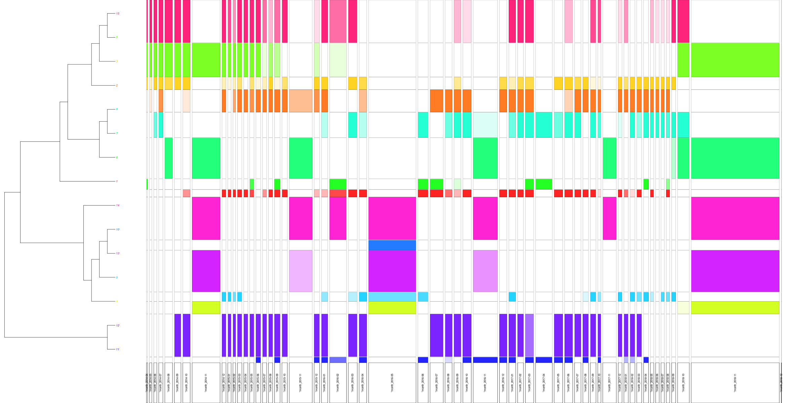

# 

1. Why archiving tweets?

2. Case studies

3. The different ways to collect tweets

# Why archiving and analysing tweets?

## Tweets are primary sources {data-background-image="../img/obama4moreyears_trans.png"}
 
 They can help understand 

- how people engage with history and the past
- how collective memories develop

Archived, they will help understand the past. 

##

<small>About this tweet, see: Joshua Sternfeld, « Historical Understanding in the Quantum Age », <em>Journal of Digital Humanities</em>, 3-2, 2014.</small>

##

  

<small>Tweet from the night of the Bataclan attack, with the #portesouvertes hashtag</small>

## Why Twitter? {data-background-image="../img/twitterAPI_bg.jpg"}
  
Because we can (could?)

-	Facebook/instagram data is hard to collect.
- Whatsapp / Snapchat are impossible to collect.

##  {data-background-image="../img/twitterAPI_bg.jpg"}

> An  <strong>application programming interface(API)</strong> is a  computing interface which defines interactions between multiple software intermediaries.  

<small>source: <a href="https://en.wikipedia.org/wiki/Application_programming_interface" target="_blank">wikipedia</a></small>   
  

## Pitfalls {data-background-image="../img/blacktwitter.jpg"}

Who are we studying when collecting and analysing Twitter data? 

- the demographics of Twitter is complicated (if not impossible) to understand
- the diversity of Twitter accounts
  - people, institutions, groups, bots, etc.

## What do we study with Twitter? {data-background-image="../img/vibrations_bg.jpg"}

 

Information circulation (memetics) where information is understood in a very wide meaning. 

<small>See: Dominique Boullier, « Big data challenges for the social sciences: from society and opinion to replications », <em>arXiv:1607.05034 [cs]</em>, 2016.</small>

 

Practices  

# Case studies {data-background-image="../img/background03.jpg"} 
  
<strong>ww1 and #covid19</strong>

## Engaging with the past {data-background-image="../img/douaumont_trans.jpg"}

### the Centenary of the First World War 

- Unique series of commemoration
- 2014-2018
- Throughout Europe and North America

 9 millions+ tweets collected 

## {data-background-image="../img/douaumont_trans.jpg" data-background-opacity="0.07"} 

 
## {data-background-image="../img/douaumont_trans.jpg"} 

 
## {data-background-image="../img/douaumont_trans.jpg"} 

 
## Memory in the making: #covid19fr {data-background-image="../img/schnabel_bg.png"}

## {data-background-image="../img/schnabel_bg.png"}

# Different ways to collect tweets {data-background-image="../img/figure01_bg.png"}

## 

- Buying tweets
- Search API
- Streaming API
- scrapping

## An evolving API

### Search API (v1.1) (deprecated)

- You can look for tweets in the past (up to 7 days)
- You can collect around 3000 tweets per hour
- No need to get a twitter developper account

##

### Streaming API (v1.1) (deprectated) 

- You can get up to 1% of the firehose (of the tweets published at a precise moment)
- Only tweets being published / will be published: necessity to anticipate
- You need a twitte developper account

## API v2 academic product track

- Search
	- 10 millions tweets pro month
	- in the full history of Twitter
	- but...
- Stream
	- less than the 1%
	
Not clear wether this product will disappear or not. For now, it is still working, despite the Twitter's current muskian API ransacking. 	

## Web scrapping

- Not Twitter TOS compliant
- Less metadata
- But you can get tweets up to 2006 (creation of Twitter)

# Bibliography and Tools

## Tools

- <a href="https://github.com/digitalmethodsinitiative/dmi-tcat" target="_blank">DMI TCAT</a> (streaming API)
- TAGS (search API)
- <a href="https://twarc-project.readthedocs.io/en/latest/" target="_blank">twarc official documentation</a>
	- <a href="https://www.docnow.io/" target="_blank">DocNow Website</a>
	- <a href="https://github.com/inactinique/twarc_training" target="_blank">My twarc tutorial (French)</a>	
- <a href="https://github.com/inactinique/aut_handson" target="_blank">aut_training repo</a>
- Archives Unleashed toolkit
	- <a href="https://github.com/archivesunleashed" target="_blank">repositories</a> and <a href="https://archivesunleashed.org/" target="_blank">website</a>

## Bibliogaphy

- Valérie Schafer, Gérôme Truc, Romain Badouard, Lucien Castex et Francesca Musiani, « Paris and Nice terrorist attacks: Exploring Twitter and web archives », <em>Media, War &amp; Conflict</em>, 2019.  
- Evelien D’heer, Baptist Vandersmissen, Wesley De Neve, Pieter Verdegem et Rik Van de Walle, « What are we missing? An empirical exploration in the structural biases of hashtag-based sampling on Twitter », First Monday, 22-2, 2017.  
- Martin Grandjean, « A social network analysis of Twitter: Mapping the digital humanities community », <em>Cogent Arts &amp; Humanities</em>, 3-1, 2016, p. 1171458. 
- Michael Zimmer, « The Twitter Archive at the Library of Congress: Challenges for information practice and information policy », First Monday, 20-7, 2015.  
- Shirley A. Williams, Melissa M. Terras et Claire Warwick, « What do people study when they study Twitter? Classifying Twitter related academic papers », Journal of Documentation,  69-3, 2013, p. 384‑410.
- danah boyd, Scott Golder et Gilad Lotan, « Tweet, tweet, retweet: Conversational aspects of retweeting on twitter », IEEE, 2010.
- danah boyd et Nicole B. Ellison, « Social Network Sites: Definition, History, and Scholarship », Journal of Computer-Mediated Communication,  13-1, 2007, p. 210‑230.
- Hany M. SalahEldeen et Michael L. Nelson, « Losing My Revolution: How Many Resources Shared on Social Media Have Been Lost? », arXiv:1209.3026, , 2012.  
- Cervulle, Maxime, and Fred Pailler. ‘#mariagepourtous : Twitter et la politique affective des hashtags’. Revue française des sciences de l’information et de la communication, no. 4, Jan. 2014. rfsic.revues.org, http://rfsic.revues.org/717.
- Jean-Christophe Peyssard, « Archiving Web Content ». https://halshs.archives-ouvertes.fr/cel-02130558/document

<strong>Two prez:</strong> «How to deal with 4 millions+ tweets when you are not a data scientist» (<a href="https://orbilu.uni.lu/handle/10993/35017" target="_blank">https://orbilu.uni.lu/handle/10993/35017</a>) and «Twitter data as primary sources for historians: a critical approach» (with S. Papastamkou) (<a href="https://orbilu.uni.lu/handle/10993/37070" target="_blank">https://orbilu.uni.lu/handle/10993/37070</a>)

## Documenting the Now

