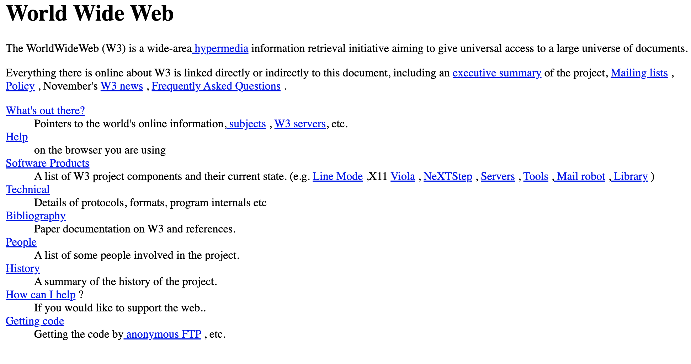
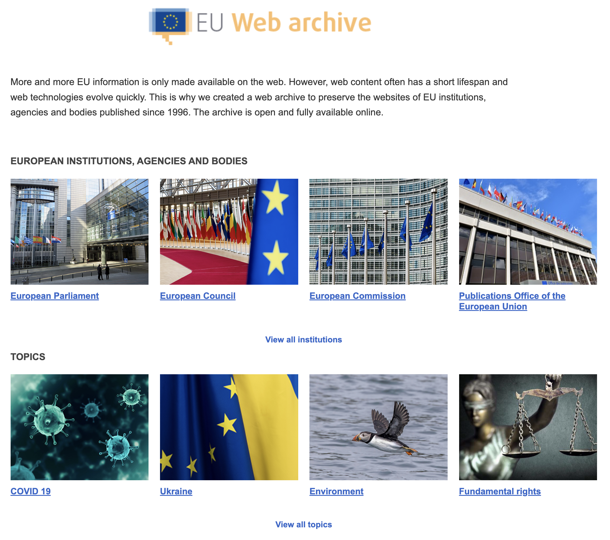
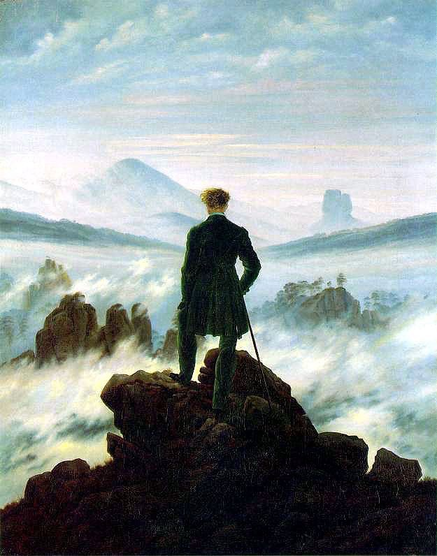
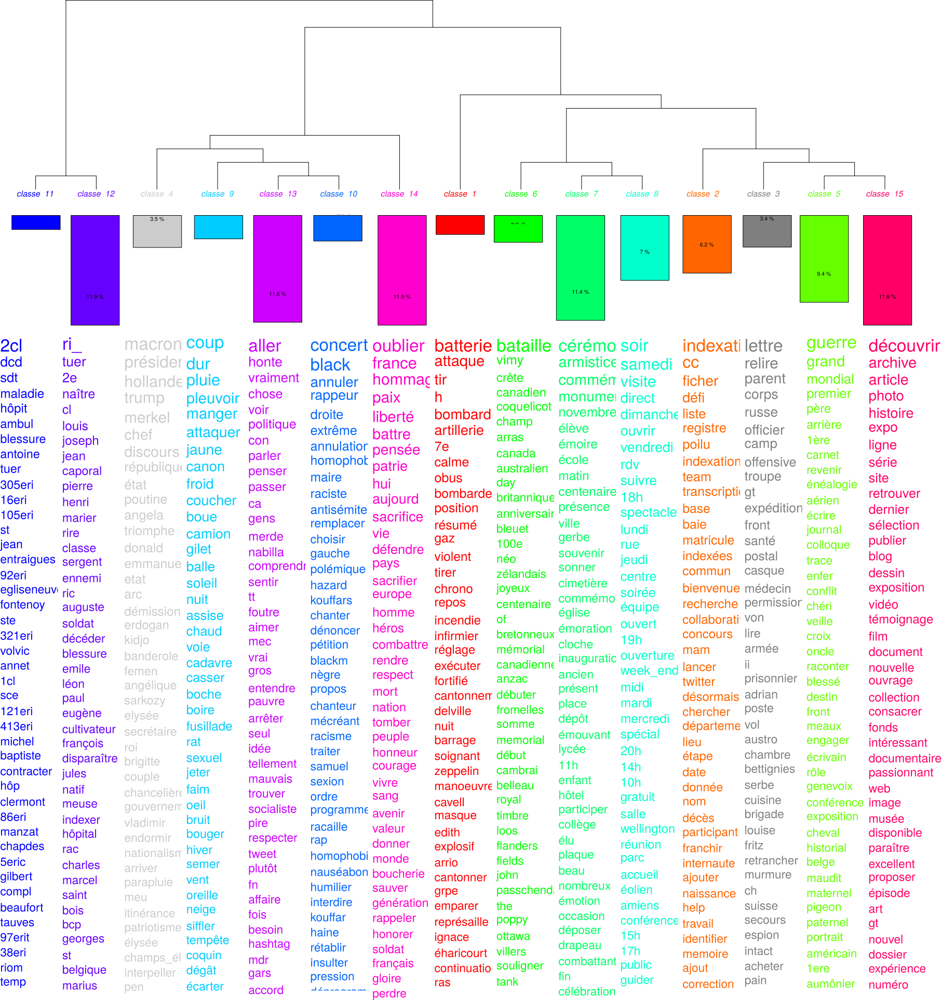

# qui suis-je?

histoire des relations internationales

histoire numérique

digital memory studies

## 

trois projets de recherche:

- #ww1 / le centenaire de la grande guerre sur twitter
- #covid19 / un pays confiné sur twitter  (avec deborah paci)
- awac2 / analysing web archives of the covid crisis through the iipc novel coronavirus dataset  (avec susan aasman, niels brügger, sophie gébeil, valérie schafer, joshgun sirajzade, karin de wild)

<aside class='notes'>

Je vais parler des archives du web mais également des cas où, comme chercheurs et chercheuses, nous créons nos propres corpus à partir des traces des grandes plateformes du web, plus particulièrement twitter dans mon cas.

Sur le base de ces trois projets de recherche et, donc, de ma propre expérience, je vais essayer de passer en revue ce qu'il est possible de faire avec des sources primaires issues du web.

Mon expérience est plutôt quantitative et cette présentation va le refléter, mais garder toujours en tête que les démarches qualitatives sont possibles.

</aside>

# l'archive infinie

<!--  -->

<small>Milligan, Ian. [‘Lost in the Infinite Archive: The Promise and Pitfalls of Web Archives’](https://doi.org/10.3366/ijhac.2016.0161). International Journal of Humanities and Arts Computing, vol. 10, no. 1, Mar. 2016, pp. 78–94.</small>

<aside class='notes'>

Je ne sais pas exactement d'où vient l'expression "infinite archive" -- mais je l'ai vue pour la première fois utilisée par William J. Turkel (University of Western Ontario) en 2008. Autre canadien, Ian Milligan l'a aussi utilisée.

Bien sûr, il ne s'agit pas d'une archive infinie à proprement parler mais le web est en soi tellement vaste qu'il est infini pour l'entendement humain. 

Internet archive, c'est plus de 800 milliards de pages web. *Common Crawl*, c'est plus de 80 To compressés (et c'est un version très épurée d'une archive du web) en 2023 (102 Tb non compressés en 2013).

</aside>

## des sources variées

- newsgroups (usenet / google groups)
- le web et ses 30+ ans d'histoire et de sites (parfois perdus)
- réseaux sociaux numériques et grandes plateformes du web

etc.

## de nouvelles sources

ia génératives: les prompts (requêtes), les textes et images engendrées, etc. 

## des sujets de recherche variées

- [migrations / diasporas](http://www.e-diasporas.fr/index.html#top) - dana diminescu
- [sociabilités et troubles alimentaires](https://www.pressesdesmines.com/produit/le-phenomene-pro-ana/) - antonio casilli / paola tubaro
- [histoire parlementaire](https://research.utu.fi/converis/portal/detail/Publication/175659577?lang=fi_FI) - kimmo elo
- [(digital) memory studies](https://www.routledge.com/Digital-Memory-Studies-Media-Pasts-in-Transition/Hoskins/p/book/9781138639386) - andrew hoskins
- [genre](https://journals.openedition.org/ctd/6049?lang=fr) - thibault grison / virginie julliard
- [espaces publics](https://journals.openedition.org/ctd/6049?lang=fr) - fred pailler / maxime cervulle
- histoire du temps présent: [projets asap (valérie schafer)]((https://asap.hypotheses.org/)) / [multitude de projets autour du covid-19](https://covidmemory.lu/)
- le web lui-même: reconstitution d'un [domaine national disparu (.yu)](https://doi.org/10.1177/1461444816643790)
- [histoire sociale et web](https://journalofdigitalhistory.org/en/cfp/history-of-the-web) (nadezhda povroznik)

etc...

# des sources à évaluer

## sources archivées...

**archives du web**

<aside class="notes">

Vous avez aujourd'hui énormément, si j'ai bien compris, parlé d'archives du web. Les dépôts légaux nationaux sont sans conteste les plus complets, avec des indexations régulières, et des opérations d'archivage -- parfois sur des sujets qui ne sont pas nationaux -- plus ponctuelles, des collections.

Néanmoins, l'une de ces archives nationales a comparé ses collections, celles d'internet archive et celles de common crawl -- une sorte de capture du web vivant, qui sert à entraîner des intelligences artificielles comme chatgpt -- et s'est aperçu qu'IA pouvait avoir archivé certains sites qu'elle n'avait pas archivé et que, si CC avait nettement moins de sites de cet État, quelques sites y étaient présent qui n'étaient pas dans l'archive de la BN en question.

Par ailleurs, les politiques d'archivage divergent d'une institution nationale à l'autre. Vous avez eu un bel exposé sur la politique duale française (BNF / INA), mais il faudra, si vous en utilisez une autre, regarder précisément les conditions de collecte. La bibliothèque nationale suisse par exemple archive surtout les « gros » sites -- c'est-à-dire n'archive pas le web vernaculaire.

Même en France, l'archivage du web vernaculaire est parfois débattu: l'archivage en cours, avant fermeture, des SkyBlogs, par l'INA, se fait sur certaines conditions. C'est à la fin un échantillon qui sera archivé.

Il est toujours intéressant de regarde ce qu'Internet Archive a archivé. Comme l'ont constaté ces collègues évoqués ci-dessus, il peut y avoir des archivages complémentaires à votre recherche.

Alors, dans quelle archive aller? tout dépend un peu de votre sujet et, parfois, combiner est la meilleure solution, d'autant plus qu'avec ces différentes archives, il y a aussi souvent des outils différents.

</aside>

## ...sources sauvées...

- geocities

<small>Milligan, Ian. ‘Welcome to the Web: The Online Community of GeoCities during the Early Years of the World Wide Web’. in: *The Web as History: Using Web Archives to Understand the Past and the Present*, edited by Niels Brügger and Ralph Schroeder, UCL Press, 2017. DOI.org (Crossref), https://doi.org/10.2307/j.ctt1mtz55k.</small>

- [sucho](https://sucho.org)

- [docnow](https://www.docnow.io/) - twitter et l'activisme politique

- mais aussi perdues: mygale.org, myspace avant 2013, etc. 

<aside class="notes">

Par les services d'archives du web ou en dehors, il y a eu des opérations pour sauver des sources en ligne. J'ai cité les SkyBlogs, mais en dehors de l'archivage du web par les institutions nationales, il y a aussi des organismes qui essayent de sauver des archives du web:

- geocities par le groupe ArchiveTeam
- SUCHO 
- docnow pour l'activisme tel qu'il s'exprime sur twitter, à la suite des manifestations de Ferguson puis #blacklivesmatter

Mais, si l'on prend l'équivalent français de geocities, mygale, devenu ensuite multimania, ce n'est pas archivé. myspace a aussi effacé énormément de données en 2013, etc.

Il y a donc des trous dans l'archivage du web et des médias sociaux, comme dans toute archive d'ailleurs, mais il faut les en être conscient.

</aside>

## ...sources à collecter

- de natures variées (newsgroups, social media, etc),
- des techniques de collecte diverses,
- de plus en plus difficiles à collecter
- conditions éthiques et légales à considérer

<aside class='notes'>

On peut aussi collecter de nombreuses sources en ligne soi-même ou en collaboration avec quelqu'un issu des sciences informatiques.

Ces sources sont très diverses: on peut récupérer, via Google Groups par exemple, des messages postés sur des newsgroups depuis les anées 1980 (trouver le premier émoticône, le premier troll, etc). Bien sûr, l'on peut collecter des informations sur des sites web non archivés, des posts des médias sociaux, etc.

Les techniques pour les collecter sont également diverses. Répartissons-les en deux grandes familles:

- le scrapping: un script se fait passer pour un internaute et récupère les informatons,
- la connexion plus officielle à ce que l'on appelle une API / interface de programmation.

Ces sources sont de plus en plus difficiles à collecter, car depuis au moins 2016, sous prétexte du scandale cambridge analytica, le web se ferme, en tout cas sur le plan des données qu'il produit. Le projet AnR algopol avait ainsi fait les frais des modifications d'API de facebook. Les deux dernières modifications en date sont celles des API de Reddit et twitter. POur l'*academic product tracj* -- qui permettait depuis trois ans de collecter 10 millions de tweets dans tout l'historique de Twitter sous condition d'être reconnu comme chercheur par twitter, a été fermée il y a une semaine. Reddit a aussi modifié son API dans le même sens : il y avait toujours une possibilité, sous conditions, de collecter des données gratuitement, cela n'est plus possible.

Les motifs ne sont pas le respect de la vie privée, mais sont bien commerciaux d'une part, la volonté de contrôler ce que chercheurs et chercheuses font (c'est-à-dire critiquent) d'autre part.

Enfin, collecter ses données, outre la rigueur dans la collecte qu'il faut s'imposer, pose des enjeux éthique et de protection des données qui ne sont pas négligeables.

# lire les sources de l'archive infinie

## lecture proche, lecture distante...

<aside class="notes">

Vous voyez ici un tableau de Friedrich, mais peut-être aussi, un checheur ou une chercheuse face à une mer de données. Avec les archives du web ou des données issues du web d'une manière ou d'une autre, le risque -- ou l'avantage -- d'avoir un corpus pour ses recherches qui soit massif est grand.

Donnons ici au terme big data une définition simple: lorsque l'on ne peux plus lire soi-même ses sources.

Alors, on doit demander à l'ordinateur de lire pour nous: c'est la lecture distante proposée par Franco Moretti en 2007. Pour Moretti, il s'agissait de pouvoir faire une histoire de la littérature européenne qui soit plus complète, inègrant les oeuvres des auteurs et autrices oubliées mais aussi les œuvres oubliées des auteurs et autrices connues.

Par contre, je ne propose pas le même pacte avec le diable que Moretti: il ne s'agit pas d'abandoner l'analyse classique des sources pour une seule lecture distante. 

L'opposition lecture proche / lecture distante est d'ailleurs une opposition issue plutôt du champs littéraire, et finalement pas nécessairement adaptée à la pratique d'autres sciences humaines et sociales.

</aside>

## ...lecture multiscalaire

<small>Clavert, Frédéric, and Andreas Fickers. ‘On Pyramids, Prisms, and Scalable Reading’. Journal of Digital History, no. jdh001, 2021, https://journalofdigitalhistory.org/en/article/jXupS3QAeNgb.</small>

<aside class="notes">

Nous penchons plutôt pour pour une articulation entre:

- lecture proche (la lecture classique de ses sources par l'historien-ne)
- lecture machinique (lecture proche aidée par l'ordinateur: la recherche par mots clé dans un document PDF par exemple),
- lecture distante.

</aside>

## la lecture distante pour comprendre un corpus

<centre>  *analysing web archive of the covid crisis (awac2)* 
<small>archives unleashed (waterloo) / archive-it (internet archive)</small></centre>

<aside class="notes">

- corpus covid-19 de l'IIPC
- au démarrage du projet: 5Tb
- coopération internationale, énormément d'institutions y cont contribué.
- comprendrele corpus nous a pris plus d'un an, car chaque institution, malgré les instructions de l'IIPC, a appliqué aussi ses critères.
- avec S. Aasman, Niels Brügger, Sophie Gébeil, Valérie Schafer, Joshgun Sirajzade, Karin de Wild
- un ensemble d'entretiens menés par le réseau WARCnet (Danemark) nous a aidé,
- mais aussi et surtout la lecture distante du corpus. 

Par exemple:

- la question des langues (plus de 50)
- la question des doublons, des copies et des versions
- exemple de la banque nationale suisse
- qualité des métadonnées, etc.

Ici, la lecture distante, avant de nous permettre de faire des analyses, nous permet d'abord de comprendre le corpus lui-même. Finalement la logique de Claire Zalc et Claire Lemercier: travailler avec ces fichiers, etc. est une manière de connaître ses sources.

</aside>

## la lecture distante à des fins d'analyse

<aside class='notes'>

Toutes les visualisations que vous allez voir ici sont faites avec des logiciels (ici iramuteq et gephi, mais j'utilise de plus en plus du code ad hoc stocké dans des notebooks) qui me permettent de revenir à des tweets, dans ce cas-ci, précis, donc d'articuler ces visualisations à des tweets, des sources préçis et à leur lecture proche.

</aside>

##

##

## 

##

##

## la lecture proche des archives du web

<small>Brügger, Niels. The Archived Web: Doing History in the Digital Age. MIT Press, 2018.</small>

<aside class='notes'>

- j'insiste sur la lecture distante, dans la mesure où c'est celle que j'ai le plus pratiqué. Cela ne veut pas dire, à l'évidence, que toute autre méthode est mauvaise,
- par ailleurs, si vous travaillez sur des corpus du web archivé, vous aurez souvent des outils de lecture distante proposé par les services du dépôt légal: je vous laisse chercher les travaux de Valérie Schafer pour le projet ASAP sur les attentats de 2015 et les outils de l'INA. Internet archive a aussi beaucoup d'outils à explorer
- pour la lecture proche (et aussi distante), il y a quand même plusieurs éléments à considérer, développés dans le livre de Niels Brügger:

  - analyser ce qui est visible (le fichier html interprété par votre navigateur)
  - analyser ce qui ne l'est pas: le code html, le code css, éventuellement le code javascript
  - faire la différence entre ce qui est destiné à l'humain et ce qui est destiné à l'ordinateur
  - regarder les fichiers liés (les fichiers de style, par exemple: les css)

etc.

</aside>

# enjeux et limites méthodologiques

## archives reconstituées et inconsistences temporelles

<small>Brügger, Niels. The Archived Web: Doing History in the Digital Age. MIT Press, 2018.</small>

<small>Clavert, Frédéric, Mahroug, Sophia, Schafer, Valérie. ‘Préservation et distorsion : l’espace-temps des réseaux socio-numériques et du web archivé’. Revue d’histoire culturelle, vol. 2022, no. 5, Oct. 2022, https://doi.org/10.56698/rhc.2791.</small>

<aside class='notes'>

Les archives du web stockent des pages web qui, pour le web dynamique notamment mais pas uniquement, ont pu ne jamais exister ou du moins ne jamais être vues par des internautes, pour différentes raisons:

- page web dynamique: sa constitution 'à la demande' (sauf cache) peut-être unique au moment où le crawler passe,
- problèmes techniques faisant que le crawler, par exemple, n'arhivera pas une image => cas du logo du CNRS. Sur internet archive, on peut voir, d'ailleurs, les différences temporelles des différents éléments d'un page (capture présentée)

</aside>

## choix des outils et choix historiographiques

<aside class='notes'>

C'est une évidence de dire que les outils ne sont ni bons, ni mauvais, ni neutres. Un logiciel, c'est un choix.

- Un choix technique: *topic modelling*: iramuteq ou MALLET?
- Un choix historiographique: ex: gephi et Latour

Importance de documenter ses choix.

</aside>

## dépendance aux grandes plateformes

<small>
[« Les conversations sur les médias sociaux sont des expressions démocratiques qui ne sauraient être cachées à la recherche »’](https://www.lemonde.fr/idees/article/2023/06/16/les-conversations-sur-les-medias-sociaux-sont-des-expressions-democratiques-qui-ne-sauraient-etre-cachees-a-la-recherche_6177952_3232.html).  Le Monde.fr, 16 Juin 2023.
</small>

<aside class='notes'>

Voici une anecdote: nous avons, avec Hannah Smyth (UCL), préparé pour un site de mon centre de recherche appelé ranke2 une leçon sur la collecte de tweets et les analyses qui sont possibles. Nous avons pour cela pris l'exemple d'un service, appelé netlytic. Ce service ou un autre, cela n'a pas d'importance: le résultat aurait été le même.

pour des raisons multiples -- un nouveau mode de publication des leçons -- , la leçon a été publiée quelques temps après la fin de sa rédaction.

Et donc: Elon Musk. Depuis le 30 avril, la leçon, publiée la semaine dernière seulement, ne peut plus marcher. On va la modifier pour en faire un témoin de ce que, en tant que chercheurs et chercheuses, vous devez garder à l'esprit: l'instabilité de l'accès aux données.

Même l'accès qui avait été mis en place spécifiquement pour les chercheurs en 2021 (academic product track) a été fermé mardi dernier. 

Bien évidemment, les conditions d'accès aux corpus varient selon la plateforme mais également selon les modes d'archivage du web. Les réseaux sociaux numériques sont toujours plus délicats que le web à archiver et la plupart du temps les collectes de tweets, de posts facebook, ont toujours fait appel à du bricolage.

Twitter n'est pas la seule plateforme à avoir fermé un accès gratuit à ses données, reddit est en train de la faire également.

</aside>

# en guise de conclusion

## pour commencer

- Gebeil, Sophie. *Website story: histoire, mémoires et archives du web*. INA, 2021.
- Schafer, Valérie. *En construction: La fabrique française d’Internet et du Web dans les années 1990*. INA, 2018.
- Brügger, Niels. *The Archived Web: Doing History in the Digital Age*. MIT Press, 2018.
- Milligan, Ian. [*The Transformation of Historical Research in the Digital Age*](https://doi.org/10.1017/9781009026055).Cambridge University Press, 2022.
- Brügger, Niels, and Ralph Schroeder, editors. [*Web as History: Using Web Archives to Understand the Past and the Present*](https://press.uchicago.edu/ucp/books/book/distributed/W/bo35506603.html). UCL Press, 2017.

## sociologie et memory studies

- Casilli, Antonio. *Les liaisons numériques vers une nouvelle sociabilité?* Le Seuil, 2010.
- Lupton, Deborah. *Digital Sociology*. Routledge, Taylor & Francis Group, 2015.
- Boullier, Dominique. *Sociologie du numérique*. Armand Colin, 2016.
- Casilli, Antonio, and Paola Tubaro. *Le phénomène ‘pro-ana’: Troubles alimentaires et réseaux sociaux*. École des mines, 2016.

- Hoskins, Andrew, editor. *Digital Memory Studies: Media Pasts in Transition*. Routledge, 2018.

## et pour aller plus loin

<small>

[publications de Dana Diminescu](https://www.telecom-paris.fr/dana-diminescu)

Grison, Thibault, and Virginie Julliard. [‘Les enjeux de la modération automatisée sur les réseaux sociaux numériques : les mobilisations LGBT contre la loi Avia’](https://doi.org/10.4000/ctd.6049). Communication, technologies et développement, no. 10, 10, May 2021.

Milligan, Ian. [‘Lost in the Infinite Archive: The Promise and Pitfalls of Web Archives’](https://doi.org/10.3366/ijhac.2016.0161). International Journal of Humanities and Arts Computing, vol. 10, no. 1, Mar. 2016, pp. 78–94.

Milligan, Ian. [‘Welcome to the Web: The Online Community of GeoCities during the Early Years of the World Wide Web’.](https://doi.org/10.2307/j.ctt1mtz55k) in: *The Web as History: Using Web Archives to Understand the Past and the Present*, edited by Niels Brügger and Ralph Schroeder, UCL Press, 2017.

Clavert, Frédéric, and Andreas Fickers. [‘On Pyramids, Prisms, and Scalable Reading’](https://journalofdigitalhistory.org/en/article/jXupS3QAeNgb). Journal of Digital History, no. jdh001, 2021.

Clavert, Frédéric, Mahroug, Sophia, Schafer, Valérie. [‘Préservation et distorsion : l’espace-temps des réseaux socio-numériques et du web archivé’](https://doi.org/10.56698/rhc.2791). Revue d’histoire culturelle, vol. 2022, no. 5, Oct. 2022.

</small>

## pour aller plus loin (suite)

<small> 

[« Les conversations sur les médias sociaux sont des expressions démocratiques qui ne sauraient être cachées à la recherche »’](https://www.lemonde.fr/idees/article/2023/06/16/les-conversations-sur-les-medias-sociaux-sont-des-expressions-democratiques-qui-ne-sauraient-etre-cachees-a-la-recherche_6177952_3232.html). Le Monde.fr, 16 Juin 2023.

Cervulle, Maxime, and Fred Pailler. [*‘#mariagepourtous : Twitter et la politique affective des hashtags’*](http://rfsic.revues.org/717). Revue française des sciences de l’information et de la communication, no. 4, Jan. 2014.

Ben-David, Anat. [‘What Does the Web Remember of Its Deleted Past? An Archival Reconstruction of the Former Yugoslav Top-Level Domain’](https://doi.org/10.1177/1461444816643790). New Media & Society, vol. 18, no. 7, Aug. 2016, pp. 1103–19.

</small>