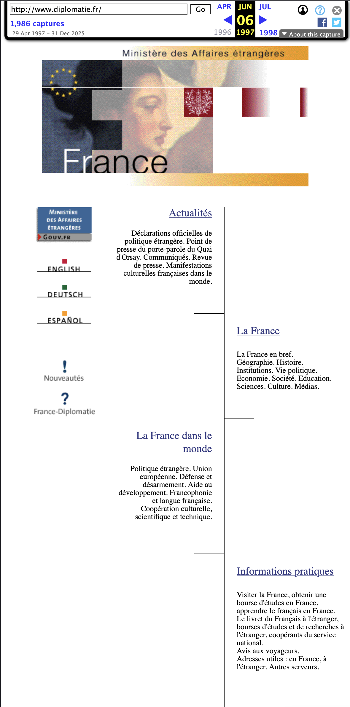
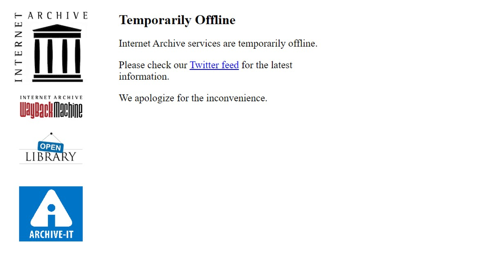
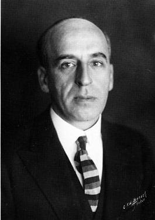

# Plan {data-background="../img/darpa_bg.png"}

1. D'une histoire par les données à des pratiques numériques discrètes
2. Cas d'étude : archives numérisées, archives nées numériques
3. L'IA et l'histoire des relations internationales

<aside class="notes">

- remerciements pour Cédric Cotter,
- rappel de mon parcours

Présentation en trois temps:

- retour sur deux articles de 2015 et 2016 par Connelly et moi-même, (Cahiers de l'IRICE / Bulletin de l'Institut Pierre Renouvin) sur la question d'une « histoire par les données » appliquée aux RI, et lien avec les pratiques discrètes.

- deux cas d'étude concrets : la numérisation des archives de la SDN et l'usage des archives du web pour l'histoire des RI.

- Enfin, ce qui arrive / est déjà arrivé de manière discrète: l'intelligence artificielle générative et ses implications pour notre discipline.

Mon fil conducteur : le passage progressif d'une réflexion centrée sur les méthodes (la lecture distante, les données massives — mon texte de 2016) à une réflexion centrée sur les pratiques quotidiennes des historiens et historiennes (le travail avec Caroline), et enfin à un questionnement sur ce que l'IA fait à — et avec — ces pratiques.

</aside>

## Une histoire « cyborg » ? {data-background="../img/wiener_bg.png"}

- Delalande & Vincent, « Portrait de l'historien-ne en cyborg » (2011)
- Cybernétique (Wiener) ≠ Intelligence artificielle (McCarthy / Minsky)
- L'ambiguïté de la métaphore « IA »

<aside class="notes">

Pourquoi le terme «cyborg»? Il ne s'agit pas de science-fiction, mais de la réalité de notre travail quand les outils numériques et l'IA deviennent indissociables de notre manière de lire, chercher, écrire.

- D'abord, le terme a une histoire: En 2011, Nicolas Delalande et Julien Vincent publiaient dans la *Revue d'histoire moderne et contemporaine* un « Portrait de l'historien-ne en cyborg ». Reprenant la figure du cyborg de Donna Haraway — qu'elle présentait comme un « mythe ironique » —, ils proposaient de décrire le corps savant de l'historien comme un organisme cybernétique reliant un individu à divers outils numériques. L'historien, disaient-ils, n'est plus cet artisan solitaire dans sa salle d'archives : il est un réseau de discours, de performances, d'artefacts et d'objets techniques. Quinze ans plus tard, avec l'IA, cette description est plus pertinente que jamais.

- Mais il y a une seconde raison:
  - le mot « cyborg » est dérivé de « cybernétique » — la science de Norbert Wiener, née dans les années 1940. Or, comme le rappellent Emily Bender et Alex Hanna dans *The AI Con*, il y a une différence fondamentale entre le projet cybernétique et le projet de l'« intelligence artificielle ».
  - Wiener et les cybernéticiens s'intéressaient à la machine elle-même, à ses boucles de rétroaction, à sa manière de traiter l'information — sans prétendre qu'elle « pensait ».
  - Quand John McCarthy et ses collègues (dont Marvin Minsky) ont organisé la conférence de Dartmouth en 1956, ils ont fait un choix de marketing autant que de science : ils ont nommé leur champ « intelligence artificielle », projetant une métaphore humaine sur la machine. Cette métaphore est devenue si puissante qu'elle structure aujourd'hui notre perception des LLMs, très anthropomorhique.

- Je préfère donc « cyborg » à « IA » parce que le cyborg assume l'hybridation humain-machine sans la confusion.
  - comprendre le fonctionnement et les relations humain-machine, pas confondre les deux.

</aside>

# Histoire des relations internationales par les données et pratiques discrètes {data-background="../img/darpa_bg.png"}

## L'histoire des RI par les données {data-background="../img/sphere_bg.png"}

- Renaissance de l'histoire diplomatique → internationale, transnationale, globale
  - Avalanche des archives numériques / nées numériques
  - Besoin de *distant reading* / articulation avec la lecture proche

- problème d'archives: 
  - biais du big data (ce qui a été détruit)
  - biais des campagnes de numérisation (effet lampadaire)

  
Connelly, Matthew. « The Next Thirty Years of International Relations Research ». Les Cahiers Irice n° 14, nᵒ 2 (2015): 85‑97. /Clavert, Frédéric. « Une histoire par les données ? Le futur très proche de l’histoire des relations internationales ». Bulletin de l’Institut Pierre Renouvin N° 44, nᵒ 2 (2016): 119‑30.

<aside class="notes">

Regardons un peu l'« état de l'art » (très superficiel) en histoire des relations internationales.

En 2015 dans les *Cahiers Irice*, Matt Connelly publiait « The Next Thirty Years of International Relations Research ». Connelly partait d'un constat optimiste : l'histoire diplomatique, qui semblait moribonde dans les années 1980 et 1990 aux États-Unis, avait connu une renaissance remarquable en se réinventant comme histoire internationale, transnationale et globale.

Mais Connelly identifiait un défi majeur pour les trente prochaines années : le *big data*. Il rappelait que les Archives nationales américaines mettaient déjà en ligne 1,1 million de câbles du Département d'État pour la seule période 1973-1976 — soit environ un milliard de mots. Et que 27 millions de documents s'étaient accumulés dans les Central Foreign Policy Files entre 1973 et 2006.

Face à cette masse, les méthodes traditionnelles de lecture proche devenaient impraticables. Connelly plaidait donc pour l'adoption de techniques comme le *data mining*, le *topic modelling*, les SIG — et pour la création de véritables « laboratoires d'histoire » interdisciplinaires, travaillant avec des informaticiens et des statisticiens. Il avait lui-même mené une expérience de ce type à Columbia.

Son propos avait aussi une dimension archivistique critique : il montrait que le secret d'État, le tri automatisé par des logiciels avec des taux élevés de faux positifs, et la destruction de collections jugées non pertinentes (six millions de documents sur les passeports et visas, les archives de la diplomatie culturelle) biaisaient profondément le registre documentaire. L'ère du *big data* n'était pas seulement une question de méthode — c'était une question d'accès et de préservation.

En 2016, j'ai évoqué dans le Bulletin Renouvin, de passer par la notion de « mise en données » — un processus allant de la numérisation d'un artefact physique aux possibilités d'analyse via des outils informatiques. Et j'avançais que la réponse méthodologique passait par l'appropriation de la notion de lecture distante de Franco Moretti, mais aussi son articulation avec la lecture proche, point de désaccord avec Connelly.

Je repartais notamment d'une expérience avec les archives Werner — où la lecture distante avait échoué à cause d'un OCR défaillant: l'alternance entre lecture distante et lecture proche était indispensable, et que la mise en données des sources posait des problèmes au moins aussi importants que le développement de nouvelles méthodes.

C'est sur ce point que mon article se distinguait : les enjeux fondamentaux ne se situent pas tant du côté des méthodes que du côté des sources primaires — numérisées comme nées numériques.

</aside>

## Les biais de la mise en données {data-background="../img/Broken_glass_screen.jpg"}

- Ce qui n'est pas numérisé → « ordre illusoire » (Milligan)
- Ce qui est mal numérisé → OCR et ses limites
- Les absences

<aside class="notes">

Ce dialogue posait et pose toujours la question des biais de la mise en données.

Penchons nous non sur les méthodes que sur les sources. En 2016, en m'appuyant sur Ian Milligan, je pointais un « ordre illusoire » : les grandes bases de données en ligne donnent l'impression d'une exhaustivité qui n'existe pas. Pour l'histoire de la construction européenne, le CVCE et l'AEI étaient très utilisés, mais documentaient très mal leurs critères de sélection des documents.

Je rappelais aussi les problèmes liés à l'OCR — la reconnaissance de texte —, qui rendaient par exemple mon propre travail de lecture distante sur les archives Werner scientifiquement inexploitable. J'avais dû transformer mon chapitre en simple note méthodologique. Et je notais l'absence en ligne des Documents diplomatiques français, alors que les FRUS américains et les documents diplomatiques suisses étaient, eux, disponibles. Les DDF heureusement sont désormais disponibles sur la bibliothèque numérique diplomatique, avec une interface type gallica d'ailleurs.

Le constat de Milligan — et qui rejoint celui de Gabriela Ossenbach — c'est que « ce qui n'est pas en ligne n'existe pas » pour une proportion croissante de chercheurs et d'étudiants.

</aside>

## Les sources nées numériques (2016) {data-background="../img/cyber_text_bg.png"}

- Réseaux socionumériques: d'un accès incertain (2016) à l'*APIcalypse*
- De 40 000 mémos (Johnson) à 4 millions de courriels (Clinton)
- Les sources nées numériques converties au papier:
  - L'*Auswärtiges Amt* imprimait ses courriels encore en 2016
  - Les emails Clinton / Le cas de l'Élysée

<aside class="notes">

La seconde partie de l'article abordait les sources nées numériques. Je prenais l'exemple de GDELT — cette base mondiale d'événements extraits des médias — pour montrer qu'elle était l'incarnation même d'un ordre illusoire né numérique : en décembre 2013, une carte prédictive fondée sur GDELT considérait la France comme pays hautement instable et la Syrie comme pays sûr. Cela parce que GDELT reflète la perception du monde par les médias anglo-saxons, pas la réalité du monde.

Je pointais aussi l'explosion du volume des archives diplomatiques nées numériques — 40 000 mémos sous Johnson, 4 millions de courriels sous Clinton — et la question cruciale de leur archivage. Avec cette anecdote emblématique : l'Auswärtiges Amt archivait ses courriels en demandant à ses diplomates de les imprimer. Les diplomates deviennent archivistes malgré eux — et la perte d'information est massive. Cette question de la destruction silencieuse des archives rejoignait directement les constats de Connelly sur le tri automatisé au National Archives.

En conclusion, je plaidais, comme Connelly, pour un agenda commun — mais avec deux inflexions. D'une part, je sous-estimais encore, je crois, l'ampleur de ce qui allait arriver avec l'IA. D'autre part, là où Connelly pensait surtout méthodes et infrastructures, je pensais sources et biais. C'est ce second axe qui va me conduire vers le travail avec Caroline Muller.

</aside>

## …aux pratiques numériques discrètes {data-background="../img/giordano_bg.jpg"}

<aside class="notes">

Depuis 2017, le travail mené avec Caroline a opéré un déplacement fondamental par rapport à mon texte de 2016. Plutôt que de se demander quelles méthodes numériques adopter, nous nous sommes demandé ce que les historiens et historiennes font déjà avec le numérique — souvent sans le formaliser, sans en parler, parfois sans même en avoir conscience.

C'est ce que nous avons appelé les « pratiques numériques discrètes » : photographier des archives avec son smartphone, interroger un moteur de recherche, organiser ses photos dans des dossiers, utiliser des tableaux Excel colorés pour trier ses sources. Ces gestes ne sont presque jamais pensés comme des gestes de recherche, et pourtant ils structurent profondément le travail historique.

Notre posture n'est pas normative. Nous ne disons pas « il faut utiliser tel outil » — nous défendons plutôt un « bricolage raisonné », c'est-à-dire une attention réflexive à nos propres pratiques et à leurs effets sur la recherche. L'enjeu n'est pas la standardisation, mais l'élucidation.

</aside>

## Appliquer cette grille aux RI {data-background="../img/sphere_bg.png"}

- L'historien(ne) des RI face au numérique : mêmes gestes, terrains spécifiques
  - Quelles archives (diplomatiques) numérisées? (et accessibles)
- Sources nées numériques (diplomatiques) :
  - des corpus massifs et multilingues... dont on ne connaît pas encore bien les conditions d'archivage
- spécificités : accès souvent restreint, classification, multilinguisme

<aside class="notes">

Si l'on applique la grille de lecture d'*Écrire l'histoire* à l'histoire des relations internationales, on retrouve les mêmes pratiques discrètes : la photographie d'archives dans les centres diplomatiques (quand autorisé), l'usage quotidien de Google Scholar ou de bases en ligne comme les FRUS, la constitution de corpus à partir de sources hétérogènes.

Mais l'HRI a ses spécificités.

D'abord, la question de l'accès :

- les archives diplomatiques restent souvent classifiées ou soumises à des délais de communicabilité longs. L'IGI 1300 en France n'a certainement pas amélioré les choses, avec des archives -- les échanges De Gaulle Johnson par exemple -- qui sont tout d'un coup devenues inaccessibles;

- le multilinguisme : travailler sur des sources en plusieurs langues pose des problèmes spécifiques pour la lecture distante et l'analyse automatisée.

- Enfin, l'échelle : les archives d'organisations internationales représentent des volumes considérables — ce qui nous amène à nos deux cas d'étude.

La question de 2016 — « comment faire de l'histoire dans un monde de données ? » — se reformule en 2026 : comment nos pratiques quotidiennes, discrètes ou non, façonnent-elles l'histoire des relations internationales que nous écrivons ?

</aside>

# Deux cas d'étude {data-background="../img/darpa_bg.png"}

## La numérisation des archives de la SDN (LONTAD) {data-background="img/sdn_bg.png"}

- Accès numérique complet aux archives de la SdN
- 2017–2022, 5 ans, 30 personnes
- 14,2 millions de pages numérisées
- ~220 Tb de données
- Accès libre en ligne

<aside class="notes">

Le premier cas d'étude est un exemple emblématique de numérisation d'archives pour l'histoire des relations internationales : le projet LONTAD (Total Digital Access to the League of Nations Archives), mené par la Bibliothèque et Archives de l'ONU à Genève entre 2017 et 2022.

En cinq ans, l'intégralité des archives de la Société des Nations — environ 15 millions de pages, soit près de trois kilomètres linéaires — a été numérisée et mise en libre accès. C'est un volume colossal : 220 téraoctets de données. Le projet, financé par une fondation privée suisse, a impliqué une trentaine de personnes et couvert non seulement la numérisation à proprement parler, mais aussi la restauration physique des documents, le remplacement de plus de 8 000 boîtes, et la création de métadonnées.

Les archives de la SDN sont inscrites au Registre de la Mémoire du Monde de l'UNESCO depuis 2009. Leur numérisation intégrale est un événement majeur pour l'histoire des relations internationales de l'entre-deux-guerres.

Les archives de la SdN, c'est aussi une forme de compagnonage avec l'école franco-suisse d'histoire des relations internationales. Les anciens index, par exemple, ont été élaborés avec Victor-Yves Ghebali à l'occasion de sa thèse, ou quelqu'un comme Nicole Pietri pour sa thèse sur la reconstruction économique et financière de l'Autriche qui est l'une des premières missions de la SdN.

Lors de mon premier passage dans ces archives, ce sont encore ces index que j'ai consultés.

</aside>

## politiques de numérisation {data-background="img/sdn_bg.png"}

<aside class="notes">

LONTAD illustre parfaitement des enjeux qui se posent aujourd'hui:

- Premièrement, les choix de numérisation sont aussi des choix historiographiques. Le projet a procédé par sections — Section politique, Section économique, etc. — en priorisant l'ordre de traitement en fonction de la demande de recherche et des événements institutionnels, notamment le centenaire de la SDN en 2019-2020. Ce n'est pas un hasard si la Section politique a été numérisée en priorité.

- L'OCR sur des documents des années 1920-1940, en plusieurs langues (français, anglais principalement, mais aussi d'autres), reste un défi. Les fichiers d'accès sont des PDF avec OCR, mais la qualité de reconnaissance varie — et cela a des conséquences directes sur les possibilités de recherche plein texte et de lecture distante.

- Pour les métadonnées, le projet a dû composer avec des descriptions archivistiques accumulées sur des décennies, avec des variations de qualité et de normes. Un effort considérable de standardisation a été mené, mais le résultat reste un compromis.

Autrement dit : nous avons maintenant accès à l'intégralité des archives de la SDN en ligne — c'est formidable. Mais cela ne va pas sans les biais de mise en données classiques.

</aside>

## Un nouvel « ordre illusoire » ? Partage d'expérience {data-background="img/sdn_bg.png"}

<!-- - Avant : aller à Genève, travailler avec les archivistes
- Maintenant : requêtes plein texte depuis chez soi
- Risque : croire que le moteur de recherche donne accès à « tout »
- L'OCR filtre silencieusement nos résultats -->

<aside class="notes">

Ici, je vais me permettre de parler de ma propre expérience aux archives de la SdN, avec deux séjours en 1999 (juste avant le début de l'intervention de l'OTAN au Kosovo) pour un mémoire de DEA et en 2005 pour la thèse.

Avant LONTAD, travailler sur les archives de la SDN impliquait un séjour à Genève, une interaction avec les archivistes, une familiarisation progressive avec les instruments de recherche. Ce processus avait ses vertus : il obligeait à une compréhension intime de la logique archivistique.

Le processus était aussi de qualité différente en fonction de la qualité de la relation avec les archivistes. En 1998, elle était médiocre (avec tout le monde) et les risques de perte de temps étaient énormes à cause de cela.

En 2005, les archivistes avaient prépare des boîtes et regardé dans la partie des archives non indexéés ce qui pouvait m'intéresser -- c'est comme cela que j'ai accédé au fond Sean Lester qui m'a permis d'avoir un angle différent sur la dévaluation du florin de Danzig et le rôle de Schacht dans cette dévaluation de 1935.

Je dois aussi rappeller que ces archives sont au Palais des Nations, inauguré en 1936 -- la SdN est en pleine crise --. Près des archives, l'ancienne bibliothèque de la SdN, qui permet aussi de voir quels livres étaient alors commandés à usage de la SdN. La possibilité d'aller au Palais Wilson, premier siège de la SdN, aujourd'hui un hotel, etc. Il y a ici la question du goût de l'archive, du contexte, qui se pose. Le Palais des Nation se situe aussi dans le quartiers des organisations internationales, etc. 

Maintenant, on peut lancer une requête plein texte depuis n'importe où. Donc le contexte physique (la salle de lecture, le palais des nations, etc) disparaît.  Cela reste un progrès considérable pour la démocratisation de l'accès, d'autant plus que la numérisation a été d'excellente qualité.

Mais le risque est celui de l'ordre illusoire : croire que la requête donne accès à tout, alors que l'OCR filtre silencieusement les résultats. Un document mal reconnu par l'OCR ne remontera pas dans une recherche par mot-clé — il devient invisible. 

On peut faire appel aux index, la SdN a suivi le principe du respect des fonds, mais toute question de recherche ne correspond pas nécessairement à un fonds bien identifié.

On ne perd pas totalement le lien avec les archivistes, grâce à une fonciton 'ask an archivist' -- mais vous n'aurez plus jamais le sentiment de déranger quelqu'un qui joue au démineur. Ni de rencontrer une archiviste qui vous sort des boîtes qu'elle connaît bien et qu'elle pense être intéressante pour vous.

C'est une illustration parfaite de ce que Caroline et moi décrivons dans *Écrire l'histoire* : le moteur de recherche est devenu un « territoire de l'histoire » — un espace qui guide, oriente et parfois trompe nos enquêtes. Et c'est un exemple de pratique discrète : combien d'entre nous réfléchissent explicitement aux limites de l'OCR quand ils lancent une requête sur les archives de la SDN en ligne ?

</aside>

## L'expérience concrète du chercheur {data-background="img/sdn_bg.png"}

- Classement par sections de la SDN → facile si on connaît le corps responsable
- Recherche par termes,
  - Pas de recherche plein texte "dynamique"
- Pas d'aperçu : il faut télécharger les fichiers PDF avant de les consulter
<!-- - JPEG-2000 master + PDF OCR d'accès → 2 couches, 2 usages -->
- Un modèle pour d'autres organisations internationales ?

<aside class="notes">

Du point de vue du chercheur, l'expérience concrète de travail avec LONTAD est à la fois remarquable et révélatrice des limites. Comme l'a noté Valentin Loos dans un billet de blog publié sur le carnet [h|r|e|f en janvier 2023](https://href.hypotheses.org/2409), la navigation est assez simple si l'on connaît le corps responsable d'un document — la Section politique, la Section économique, etc. Mais elle devient beaucoup plus difficile si l'on cherche par thème ou par terme.

Le point le plus frustrant pour beaucoup de chercheurs est l'absence d'aperçu : il faut télécharger chaque fichier PDF avant de pouvoir en consulter le contenu. C'est un frein considérable à l'exploration. Et la recherche plein texte, quand elle fonctionne, dépend entièrement de la qualité de l'OCR — qui n'est pas documentée pour l'ensemble du corpus.

Sur le plan technique, le projet a produit deux types de fichiers : des masters en JPEG-2000 à 300 dpi pour la préservation, et des PDF d'accès avec OCR intégré. Cette double couche est un choix judicieux pour la pérennité, mais elle implique aussi que l'accès en ligne dépend de la couche la plus fragile — l'OCR.

La question qui se pose est celle de l'exemplarité : LONTAD peut-il servir de modèle pour d'autres organisations internationales ? Les archives des OIN sont considérables et beaucoup sont inaccessibles. LONTAD est alors un modèle, mais il faudra aussi intégrer certaines critiques.

</aside>

## Et demain ? L'IA appliquée aux archives de la SDN (prospective)  {data-background="img/sdn_bg.png"}

<!-- - 14,2 millions de pages → un corpus massif pour l'IA
- HTR pour améliorer l'OCR existant
- Extraction automatique d'entités nommées (personnes, lieux, organisations)
- Classification thématique automatisée
- Traduction assistée (français ↔ anglais et au-delà)
- Mais : qui finance ? qui contrôle ? qui valide ? -->

<aside class="notes">

Ici je fais de la prospectives et c'est un point de vue personnel que je développe ici.

L'arrivée de l'IA -- au sens de machine learning et plus particulièrement de modèles de langue -- ouvre des perspectives considérables pour un corpus comme celui de LONTAD. Avec 14,2 millions de pages, il est humainement impossible de tout lire — c'est exactement le cas de figure décrit par Moretti pour la littérature européenne. Les techniques d'IA pourraient améliorer l'OCR existant grâce aux modèles de HTR (Handwritten Text Recognition), extraire automatiquement les entités nommées — personnes, lieux, organisations, dates — qui sont déjà pour parties extraites, d'ailleurs, proposer des classifications thématiques, ou encore faciliter la traduction entre le français et l'anglais, les deux langues principales des archives de la SDN.

On pourrait imaginer un historien ou une historienne qui interroge les archives de la SDN via un chatbot : « quels sont les documents qui traitent des réfugiés arméniens entre 1922 et 1926 ? » — et obtient non seulement une liste de documents, mais un résumé structuré, avec des liens vers les sources. C'est techniquement envisageable. C'est même, pour certaines archives, déjà en cours de développement ailleurs, même si ma collègue Finola Finn a développé de nombreux points critiques au point de parler d'illusion d'histoire instantaée [(AI: Culture & Society)](https://www.cambridge.org/core/journals/cambridge-forum-on-ai-culture-and-society/article/ai-assistants-in-the-archive-and-the-lure-of-instant-history/FE6E0D82623088BE58D7D070B432E753).  

Mais les questions critiques demeurent. Qui finance ce type de développement ? Des entreprises privées, des fondations, des États ? Qui contrôle les modèles utilisés et leurs biais ? Et surtout, qui valide les résultats ? Un historien qui utilise un résumé produit par l'IA sans vérifier dans la source originale commet une erreur méthodologique fondamentale. L'IA ne remplace pas la lecture proche — elle rend la lecture distante plus puissante, mais aussi plus risquée si elle se transforme en pratique discrète, c'est-à-dire sans vigilance critique.

</aside>

## Les archives du web et l'histoire diplomatique 

Un projet : les sites web des MAE (Clerc / Clavert)

- Hypothèse : diffusion des pratiques diplomatiques américaines après la Guerre froide
- Corpus : sites web de MAE archivés par Internet Archive (Wayback Machine)
- Analyse diachronique (années 1990 – 2015)
- Focus : pays de l'OIF vs. State Department vs. Quai d'Orsay

<aside class="notes">

Le second cas d'étude est un projet que je mène avec Louis Clerc, professeur d'histoire contemporaine à l'université de Turku. Il s'inscrit dans le cadre d'un panel que nous avons organisé à la conférence *New Diplomatic History* à Aix-en-Provence en mai 2025, sur l'usage des sources nées numériques en histoire diplomatique.

Notre hypothèse est la suivante : la fin de la Guerre froide a vu la diffusion de pratiques diplomatiques américaines vers d'autres espaces, notamment en matière de diplomatie publique, de communication en ligne, de *nation branding*. Nous étudions cette diffusion à travers l'analyse des sites web des ministères des Affaires étrangères, en nous concentrant sur un groupe de pays de l'Organisation internationale de la Francophonie. Nous comparons ces sites avec l'évolution du State Department et du Quai d'Orsay, ce qui nous donne une triangulation intéressante : le modèle américain, le modèle français, et les adoptions / adaptations dans l'espace francophone.

Le titre de notre communication — « Communicating diplomacy in a unipolar context » — dit bien l'enjeu : c'est l'histoire du « moment unipolaire » lue à travers ses traces numériques.

C'est en cours -- il n'y a pas de conclusions pour le moment.

On utilise la Wayback Machine, car c'est la seule archive du web qui couvre l'ensemble des sites web des MAE.

</aside>

## Les sites web des MAE comme source primaire {data-background="img/diplomatie_bg.png"}

- Un site de MAE dit comment un État veut se présenter au monde
- Thèmes mis en avant, langues, publics visés
- Fonctions multiples : propagande politique, services consulaires, diplomatie publique
- Évolution des sites est corrélée à l'évolution des pratiques diplomatiques

<aside class="notes">

Le site web d'un ministère des Affaires étrangères est une source primaire à part entière — et c'est une source fascinante pour l'histoire des relations internationales. Il dit quelque chose de la manière dont un État veut se présenter au monde : quels thèmes sont mis en avant, quelles langues sont utilisées, quels publics sont visés — citoyens à l'étranger, journalistes, diplomates étrangers, investisseurs.

Les fonctions de ces sites sont multiples et ont évolué dans le temps. Dans les années 1990, ils servaient souvent de vitrine institutionnelle minimale. Puis ils sont devenus des outils de diplomatie publique, avec des sections de communication destinées au grand public international. Certains ont développé des fonctions de type « intranet » pour le personnel diplomatique (pas d'accès). D'autres se sont orientés vers les services consulaires en ligne pour les citoyens à l'étranger.

L'évolution de ces sites dans le temps — leur design, leur contenu, leur structure, leur multilinguisme — est un indicateur précieux de l'évolution des pratiques diplomatiques elles-mêmes. C'est de l'histoire des relations internationales par les traces numériques.

Il est intéressant de noter qu'une équipe autour de Sabancı University a récemment constitué le dataset « GlobalDiplomacyNET » — plus de 1,16 million d'articles et 1,18 million d'images collectés sur les sites web de MAE et de chefs d'État de 156 pays sur plus de 20 ans. Cela montre que notre approche rejoint un mouvement plus large.

</aside>

## Des archives fragiles

- L'Internet Archive : archiviste par défaut, sans mandat étatique, menaces politiques
- Captures incomplètes : instantanés, pas de flux continu
- Contenus dynamiques / médias sociaux mal capturés
- Sites qui disparaissent sans préavis : les « 404 » de la diplomatie

→ Un ordre illusoire né numérique

<aside class="notes">

Mais ces sources sont fragiles. Les sites changent, les pages disparaissent, les formats deviennent obsolètes. Sans l'Internet Archive — une organisation à but non lucratif américaine —, une part considérable de l'histoire diplomatique numérique des trente dernières années serait tout simplement perdue. Car s'il y a des archives du web nationales (INA et BNF en France), de nombreux pays n'en ont pas. L'Internet Archive joue un rôle d'archiviste par défaut, sans mandat institutionnel des États concernés. C'est une situation assez inédite.

Les limites de la Wayback Machine sont bien connues mais rarement prises en compte dans la recherche : les captures sont des instantanés ponctuels, pas un flux continu. La fréquence de capture varie considérablement d'un site à l'autre. Les contenus dynamiques — bases de données interrogeables, contenus protégés par login, éléments JavaScript — ne sont généralement pas capturés. Et surtout, comme l'a noté l'équipe de GlobalDiplomacyNET, pour de nombreux sites de MAE, la Wayback Machine ne capture que les pages d'accueil — les liens vers les actualités diplomatiques ne sont souvent pas archivés.

De plus, certains pays suppriment leurs anciens contenus sans préavis ni explication. C'est l'incarnation concrète de l'« ordre illusoire né numérique » appliqué cette fois aux sources primaires de l'histoire diplomatique la plus récente.

Une petite apartée sur les archives du web: Caroline avait mené une enquête sur les thèses d'histoire contemporaine portant sur des périodes où les archives du web sont pertinentes: beaucoup n'utilisaient pas le web ou ses archives comme sources, les quelques unes qui prenaient le web comme source n'utilisaient pas les archives du web mais les sites web tels qu'ils existaient au moment de la recherche. Cela signifie ne pas prendre en compte les interfaces d'accès à l'information, comment cette dernière est présentée, mise en valeurs, etc. 

</aside>

## Méthodes et défis {data-background="img/diplomatie_bg.png"}

- Constitution de corpus via Wayback Machine / Archive-IT / Hyphe
- Analyse de contenu : *topic modelling*, *word vectors*
- Comparaison diachronique et transnationale
- Défis : multilinguisme (français, anglais, langues nationales), hétérogénéité des formats HTML, lacunes des captures
- Question de la langue : anglais vs. français dans la diplomatie numérique

<aside class="notes">

Sur le plan méthodologique, le projet a pour ambition de mobiliser des techniques de lecture distante — topic modelling (LDA), analyse vectorielle (word2vec) — appliquées à des corpus de pages web archivées. Nous utiliserons, si le projet se poursuit, des outils comme Hyphe, développé par le médialab de Sciences Po, ou les outils propres de l'Internet Archive via Archive-IT, pour constituer et explorer les corpus.

Le défi est triple et finalement en partie commun avec de nombreuses recherches en histoire des RIs.

- le multilinguisme : les sites sont en français, anglais, et souvent dans les langues nationales des pays concernés. C'est à la fois une richesse et un obstacle technique — les modèles de topic modelling fonctionnent mieux en anglais.

- l'hétérogénéité des formats : les sites des années 1990 en HTML 2.0 ou plus souvent 3.2 et ceux des années 2010 en responsive design n'ont rien à voir en termes de structure.

- Enfin, les lacunes des captures que je viens d'évoquer.

Un aspect particulièrement intéressant est la question de la langue. Nous observons à quel moment les sites de MAE francophones basculent vers le bilinguisme français-anglais, voire vers une prédominance de l'anglais. C'est un indicateur de la place du français dans la diplomatie internationale — et un sujet politiquement sensible dans l'espace de la Francophonie.

Ce projet est typiquement un exemple de recherche à l'intersection des pratiques numériques discrètes (utiliser la Wayback Machine, constituer un corpus de pages web) et de la lecture distante (appliquer des techniques d'analyse textuelle à grande échelle).

Et ici je n'évoque que les difficultés propres au projet, sans m'attarder sur les éléments méthodologiques généraux à considérer pour les archives du web -- des archives composite, reconstruite (reborn digital archive) avec des incohérences notamment de temps, etc, la difficulté à définir ce qu'est un site web, une page HTML, etc.

</aside>

# Intelligence artificielle et Histoire des relations internationales {data-background="../img/darpa_bg.png"}

## L'IA générative et l'historien(ne) des RI {data-background="../img/darpa_bg.png"}

- Depuis 2022 : ChatGPT, Claude, Gemini…
- (Probable) usage croissant, souvent discret, peu documenté
- Trois dimensions :
  - L'IA **comme outil** de recherche
  - L'IA **comme transformation** de nos pratiques
  - L'IA **comme objet** d'étude

<aside class="notes">

Depuis novembre 2022 et la sortie de ChatGPT, l'IA générative est entrée dans le quotidien d'un nombre croissant de chercheurs et chercheuses — y compris en histoire des relations internationales. Mais cet usage reste largement discret, au sens que nous donnons à ce terme dans *Écrire l'histoire* : il est peu formalisé, rarement documenté, parfois tu.

On parle ici de l'IA générative, fondée notamment sur deux types d'algorithme: les transformers (2017) qui ont cette spécificité d'être capable de prendre en compte un contexte textuel, et les modèles de diffusion pour les images.

Attention aussi à bien comprendre que les modèles de langue (pour le texte) sont distincts des chatbots: si le coeur des chatbots sont bien les modèles de langue (et de diffusion pour les modèles dits multimodaux), il y a de nombreuses couches logicielles suppleméntaires entre le modèle et l'interface utilisateur qui peuvent fondamentalement changer le texte généré, notamment des couches dites d'alignement. Ce sont ces couches logicielles qui font la différence entre CLaude et Grok: ce sont ces couches qui font que Grok se surnomme MechaHitler assez naturellement et pas Claude ou ChatGPT.

Dans les usages des historiens et historiennes, on peut utiliser des chatbots, bien sûr, leurs API (donc un appel direct au modèle de langue de la plateforme), ou des petits modèles soit hébergés sur des serveurs universitaires par exemple, soit sous certaines conditions sur un ordinateur personnel.

Je propose de distinguer trois dimensions.

- D'abord, l'IA comme outil de recherche : pour transcrire, traduire, résumer, coder, analyser des sources.
- Ensuite, l'IA comme transformation silencieuse de nos pratiques d'écriture, de lecture et de pensée.
- Enfin, l'IA comme objet d'étude historique : les systèmes d'IA produisent des représentations du passé qui sont elles-mêmes des sources pour l'historien.

Ces trois dimensions ne sont pas séparées — elles s'entremêlent constamment dans le travail quotidien.

</aside>

## L'IA comme outil pour l'Histoire des RI {data-background="../img/darpa_bg.png"} 

- Transcription / OCR amélioré (HTR)
- Traduction de sources multilingues
- Résumé et exploration de corpus massifs
- Classification, extraction d'entités nommées

<aside class="notes">

Pour l'histoire des relations internationales, les applications de l'IA comme outil sont considérables — et directement liées à nos deux cas d'étude.

Prenons les archives de la SDN : 14,2 millions de pages numérisées avec un OCR imparfait. Les modèles de type HTR (Handwritten Text Recognition) et les améliorations apportées par l'IA à la reconnaissance de texte permettent d'améliorer significativement la qualité de la transcription. Les LLMs peuvent aussi aider à l'extraction d'entités nommées — personnes, lieux, organisations —, à la classification thématique de documents, ou à la traduction de sources en plusieurs langues.

Pour les archives du web, l'IA peut aider à traiter l'hétérogénéité des formats, à résumer de grands volumes de pages, à détecter des patterns dans l'évolution des discours diplomatiques.

C'est un enrichissement potentiel fondamental qui est envisagé par diverses techniques depuis une à deux décennies, avec une différence de taille : ces outils ne sont plus l'apanage de quelques spécialistes de l'informatique — ils sont plus facilement accessibles.

</aside>

## L'IA et nos pratiques de recherche {data-background="../img/darpa_bg.png"}

- La conversation avec un chatbot comme pratique de recherche ("maïeutique stochastique")
- Ni simple extraction, ni dialogue socratique au sens classique
- Un processus itératif, probabiliste, qui fait émerger des idées

→ Une pratique numérique discrète par excellence

<aside class="notes">

Pour décrire la dynamique de la conversation entre un historien et un chatbot, j'ai proposé le terme de « maïeutique stochastique ». La maïeutique, c'est l'art socratique de faire accoucher les esprits par le dialogue. Le stochastique renvoie au fonctionnement probabiliste des LLMs — ce que Bender et al. appellent des « perroquets stochastiques ».

L'idée est que la conversation avec un chatbot n'est ni une simple extraction d'information — comme une requête Google —, ni un véritable dialogue socratique — puisque le chatbot ne « comprend » pas au sens humain du terme. C'est un processus itératif où la reformulation des questions, l'exploration de pistes inattendues, les erreurs même du système, peuvent faire émerger des idées que l'historien n'aurait pas eues seul.

C'est une pratique numérique discrète par excellence : beaucoup de chercheurs utilisent ChatGPT ou Claude pour brainstormer, reformuler, explorer — mais peu le documentent, peu en parlent, et presque personne ne l'intègre à sa méthodologie explicite. Or cette pratique a des effets sur la recherche — elle oriente les questions, suggère des cadres, propose des formulations.

</aside>

## L'IA comme objet : « sources cyborg » {data-background="../img/darpa_bg.png"}

- Les LLMs produisent des représentations du passé
- Concept de « sources cyborg » : des productions humain-machine
- L'IA comme miroir déformant des imaginaires collectifs

Exemple : comment les LLMs représentent l'histoire de l'UE

<aside class="notes">

La seconde dimension est celle que j'explore dans mes recherches récentes : l'IA comme objet d'étude pour l'historien. J'ai proposé le concept de « sources cyborg » pour désigner les productions issues de l'interaction entre un humain et un système d'IA — les prompts et les outputs des chatbots, par exemple.

Ces sources sont intéressantes parce qu'elles révèlent ce que j'appelle des « human-machine imaginaries » — des imaginaires du passé coproduits par l'humain qui formule la question et la machine qui génère la réponse. Dans mes travaux sur la manière dont les LLMs représentent l'histoire de l'Union européenne, j'ai repéré des patterns récurrents : médiévalisation de l'Europe, associations impériales, télescopage temporel. Ces représentations ne sont ni purement humaines ni purement machiniques — elles émergent de l'interaction.

Pour l'histoire des relations internationales, cela ouvre un champ : comment les systèmes d'IA représentent-ils les relations de pouvoir, les conflits, la diplomatie ? Quels biais du corpus d'entraînement se retrouvent dans les outputs ? C'est un nouveau territoire de l'histoire — au sens où nous l'entendons dans *Écrire l'histoire*.

</aside>

## Les biais géopolitiques des LLMs {data-background="../img/darpa_bg.png"}

- Étude Carnegie Endowment (janvier 2025) : « The World According to Generative AI »
- ChatGPT aligné sur la culture américaine (corpus anglophone dominant)
- Biais géographiques : les zones à faible revenu systématiquement dévalorisées
- Biais linguistiques : les LLMs « pensent » différemment selon la langue

→ Implications directes pour l'HRI : quel passé diplomatique les LLMs construisent-ils ?

<aside class="notes">

Pour l'histoire des relations internationales, les biais des LLMs ne sont pas anecdotiques — ils sont structurels. Une étude publiée en janvier 2025 par le Carnegie Endowment for International Peace, intitulée « The World According to Generative AI », a systématiquement interrogé les biais géopolitiques de plusieurs modèles d'IA.

Les résultats sont frappants. Une étude citée dans ce rapport a montré que ChatGPT, interrogé sur des dimensions culturelles dans cinq langues, s'aligne le plus fortement sur la culture américaine — probablement parce que son corpus d'entraînement est majoritairement anglophone. Les LLMs présentent aussi des biais géographiques systématiques : selon une étude de 2024 de Rohin Manvi et al., ils dévalorisent systématiquement les zones à faible niveau socioéconomique.

Pour l'historien des relations internationales, ces constats sont décisifs. Si un étudiant ou un chercheur utilise un LLM pour résumer un conflit diplomatique, explorer les positions d'un pays du Sud, ou analyser une crise, la réponse qu'il obtient est filtrée par ces biais structurels — le regard anglo-saxon sur le monde, la surreprésentation de certaines perspectives. C'est exactement l'ordre illusoire de GDELT que je décrivais en 2016, mais à une échelle et avec une puissance de persuasion inédites, puisque le texte généré a l'apparence de l'autorité.

C'est aussi un sujet pour l'histoire des relations internationales en tant que telle : l'IA devient un acteur de la diplomatie, comme le montrent les travaux récents sur la « techplomacie » et les négociations internationales autour de la gouvernance de l'IA.

</aside>

## Sean Lester à Danzig

# Conclusion {data-background="../img/darpa_bg.png"}

<aside class="notes">

Revenons au terme « cyborg » pour boucler. Dans un article que nous publions avec Caroline dans la *Revue belge d'histoire contemporaine*, nous proposons de décliner le cyborg à tous les niveaux du travail historique.

D'abord, les sources cyborg. Le concept désigne des sources pour partie engendrées par des humains et pour partie par des machines. Prenons l'exemple de la revue de presse. Quand je travaillais sur Hjalmar Schacht à la *Reichsbank*, le processus était transparent : un département préparait deux revues de presse, nationale et internationale, pour le directoire. Comprendre comment l'information arrivait à Schacht était relativement simple grâce à nos méthodes classiques — critique externe, critique interne, respect des fonds. Mais aujourd'hui ? Comment un doctorant comprendra-t-il pourquoi et comment telle actualité est arrivée à tel dirigeant, quand les revues de presse sont alimentées par des algorithmes d'apprentissage automatique qui « apprennent » de nos usages ? Ces revues de presse d'aujourd'hui sont des sources cyborg — et elles appellent des méthodes nouvelles.

D'où le concept de diplomatique cyborg : une critique des documents qui repose à la fois sur l'IA et sur les savoir-faire des historiens, des archivistes, des bibliothécaires et des informaticiens. C'est la conjugaison des méthodes de Mabillon et Ranke avec celles du *topic modelling* et du HTR. Le projet Himanis appliquant Transkribus au Trésor des Chartes, le projet EyCon utilisant l'IA sur les photographies coloniales, nos propres travaux sur la presse numérisée — tous ces exemples montrent une symbiose entre systèmes d'IA et compétences disciplinaires humaines.

Et puis il y a l'écriture cyborg. Microsoft intègre désormais Copilot dans Word — le logiciel standard des historiens et des éditeurs en SHS. L'IA générative est directement introduite dans notre outil d'écriture. Quels en seront les effets sur le style historiographique ? Notre écriture risque-t-elle de devenir une moyenne des styles historiens existants — ce qui serait un appauvrissement considérable, puisque le style est constitutif des écoles historiographiques ?

Enfin, l'historien·ne cyborg — comme l'argumentaient Delalande et Vincent en 2011, décrivant le « corps savant » de l'historien comme un organisme cybernétique reliant un individu à divers outils numériques. Quinze ans plus tard, avec l'IA, cette hybridation est plus profonde que jamais.

</aside>
